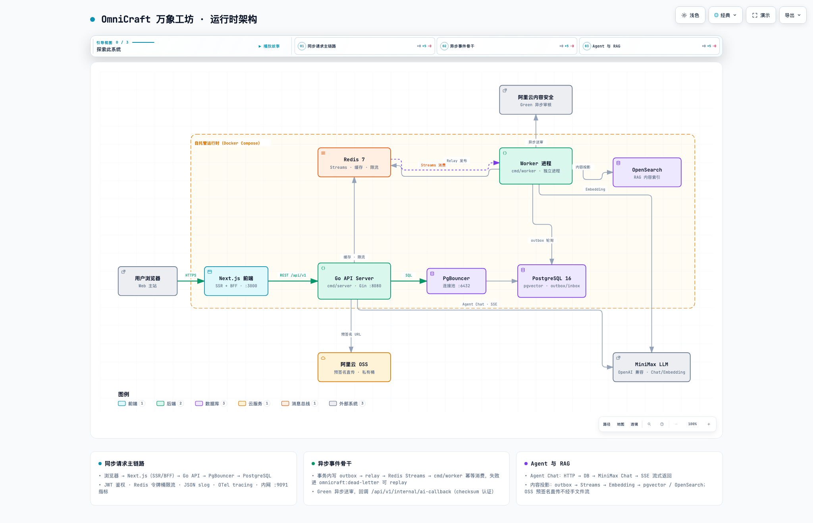

# OmniCraft 万象工坊


全民创意分享平台——以 IP 二创内容聚合为核心流量底座，Agent 自动化为增值能力，GitHub 式 PR 协同为社区护城河。

这是一个**Web-only、本地可运行、本地可测试、具备 Live Demo 的工程化项目**：在模块化单体后端（Go/Gin）上实现了带权限过滤、服务端引用复核、可降级检索和可靠异步处理的单 Agent RAG 工作台。技术栈：Next.js + Go/Gin + PostgreSQL(pgvector) + Redis + 阿里云 OSS/Green。

---

## 核心能力

### 1. Agent/RAG 检索链路

内容问答必须同时满足相关性、版本一致性和权限边界。核心取舍：**把模型当成不可信建议源，而不是权限或事实源**。

```text
用户问题
  -> Agent ChatStream（服务端固定工具注册表）
  -> search_content 工具
      ├─ PostgreSQL keyword 召回（默认读路径）
      ├─ pgvector 语义召回
      └─ 应用层 RRF 融合（OpenSearch BM25 投影契约就绪，Phase 2 启用）
  -> content_version / index_generation / is_current 复核
  -> viewer-aware 可见性过滤
  -> RevalidateCitations 服务端引用复核
  -> SSE citation / done（模型只能基于服务端确认过的内容作答）
```

- chunk 绑定 `content_id/content_version/chunk_key/index_version`，检索、融合、复核全程使用稳定 chunk identity；
- RRF 避免跨引擎 score 不可比；前 20 个候选批量复核，不足时按排序逐个补位；
- citation 不向客户端暴露内部分数；客户端只消费服务端生成的 `content_id/title/zone/route/chunk_key`。

### 2. 引用治理与 SSE 流式协议

SSE 只允许服务端定义的七类 typed 事件（`start/tool_status/delta/citation/usage/done/error`）：工具调用片段按 index 在服务端合并、一轮 provider stream 完成后才执行工具；模型伪造 title/route/version/source 或 chunk key 时，输出前的 `RevalidateCitations` 直接丢弃；取消、provider 超时、存储错误使用稳定错误码，不把原始 err.Error() 泄漏给客户端。

### 3. 可靠异步：Transactional Outbox / Worker / Inbox / DLQ

```text
业务事务（状态变更 + outbox_events 同事务提交）
  -> relay at-least-once 投递 Redis Streams
  -> 独立 cmd/worker 消费
       (consumer_group, event_id) 数据库唯一约束幂等
       指数退避重试 -> 永久失败进 DLQ -> 管理员 replay
```

DB 内副作用用 `ConsumeInboxTx`（业务写入与 inbox completion 同事务）；外部副作用（审核、embedding）必须自身幂等。明确 **at-least-once**，不声称 exactly-once。本地故障演练覆盖重复投递、ACK 丢失、Redis 停启恢复、DLQ replay。

### 4. 索引世代与降级

索引是可重建投影，不是业务真相源：rebuild 走 staging → validation → 原子切 alias → 提升 PostgreSQL `is_current`，失败保留旧世代可恢复；增量投影与 rebuild 互斥锁防并发。OpenSearch 不可用降级 PG keyword、embedding provider 失败降级 keyword-only，降级结果显式标记 source。

### 5. 归档文件安全门

Mod 压缩包先过应用层流式结构校验（路径穿越 / symlink / 加密条目 / 嵌套递归 / 解压配额，超限立即中断），再经 ClamAV worker 扫描进状态机与 append-only 审计；发布与下载双 clean-only gate，quarantine 对象即使被错误标记也永不签名下载。

### 6. 全链路可观测

OpenTelemetry W3C trace context 贯穿 HTTP → DB → LLM → SSE 与 Outbox → relay → Redis → Worker → Inbox（traceparent 进 outbox envelope）；`omnicraft-server` / `omnicraft-worker` 服务级命名。已捕获认证 MiniMax Chat 同步链路与异步 embedding 链路真实 trace，并通过 Collector 停机演练（观测丢失不影响业务健康路径）。

---

## 真实 Provider 评测（current-v1 冻结语料）

语料与查询集冻结（63 golden cases / 169 published contents·chunks / generation 2，corpus identity 与 golden-set checksum 固化），真实 MiniMax Chat + embo-01 Embedding 差分运行（2026-08-26）：

| 口径（K=10） | Recall@10 | MRR | nDCG@10 | citation precision | P95 |
| --- | ---: | ---: | ---: | ---: | ---: |
| 同 run chunk keyword baseline | 0.413 | 0.370 | 0.380 | — | — |
| **hybrid（keyword + pgvector + RRF）** | **0.492** | **0.437** | **0.450** | 0.170 | 164.8ms |

- visibility leak count `0`；degradation success rate `1.000`；
- K=20 对照（citation 0.162 / coverage 0.508）排除 Top-K 截断解释；
- 历史 253-content baseline（citation precision 0.913）经 provenance 审计判定语料快照不可恢复、口径不可比——已如实废弃并重建可信口径，**不做「提升/回归」对比**。

Agent 答案实测（同冻结语料，2026-08-29，63 case 真实工具循环）：**55/63 answered、0 降级、0 provider 错误**；SSE first-token P50 2078ms / P95 8259ms；平均 3226 tokens/答案（为此修复 MiniMax 流式 usage 两个缺陷）；引用平均 4.2 条/答案、全部通过服务端复核。groundedness/relevance 使用确定性代理指标（对转述型模型饱和，judge 层为规划中的后续叠加），不作为质量结论。

> 证据原文：`docs/working/2026-08-26-rag-real-minimax-differential-evidence.md`、`2026-08-26-rag-provenance-and-current-corpus-v1.md`、`2026-08-29-agent-answer-eval-evidence.md`。

## 运行时架构



（由 [docs/working/2026-08-29-runtime-architecture.html](docs/working/2026-08-29-runtime-architecture.html) 导出；交互版可直接用浏览器打开。完整技术架构设计见 [architecture.md](architecture.md)。）

## 项目阶段与边界

当前为本地开发与验证阶段（非生产上线系统）：

- 默认读路径为 PostgreSQL keyword/pgvector + RRF；`features.rag_hybrid_enabled=false`——OpenSearch 投影契约与降级路径就绪，最终投影是显式的 **Phase 2 决策**（隔离实验：新世代 + 小语料 + 不切基线 alias + 记录回滚点）；
- `observability.tracing.enabled=false`（演示时经环境变量开启）；`archive_malware_scan_enabled` / `desktop_deploy_enabled` 默认关闭；
- 真实 MiniMax Chat/Embedding provider 已接入并有本地链路证据；ClamAV 当前主要为 fake scanner 与协议级测试；无生产用户量/QPS/SLA 数据；
- Tauri 桌面客户端仅完成不安全原型关闭（见文末）。

---

## 本地开发

### 前提条件

| 工具 | 版本要求 | 说明 |
|------|---------|------|
| Go | 1.22+ | 后端 API 服务（CI 精确固定 1.25.13，见 `.github/workflows/ci.yml`） |
| Node.js | 20+ | 前端 Next.js（CI 固定 Node 20；`engines` 声明最低版本策略） |
| pnpm | 9+ (或 npm 10+) | 前端包管理 |
| PostgreSQL | 16+ | 需 pgvector ≥ 0.7 |
| Redis | 7+ | 缓存与会话 |
| Rust | 1.75+ | 仅 Tauri 客户端需要 |

本地满足「最低版本」即可；CI 的精确工具链由 `.github/workflows/ci.yml` 与 `tauri-ci.yml` 固定，两者不混为一谈。

### 1. 克隆仓库

```bash
git clone https://github.com/Leewwp/OmniCraft.git
cd OmniCraft
```

### 2. 启动基础设施

```bash
# 启动 PostgreSQL + Redis（Docker）
docker compose up -d postgres redis
```

### 3. 初始化数据库

```bash
chmod +x scripts/init-db.sh
./scripts/init-db.sh
```

或者手动运行迁移：

```bash
for f in backend/migrations/*.sql; do
  psql -h localhost -U omnicraft -d omnicraft -f "$f"
done
```

### 4. 配置环境变量

```bash
cp .env.example .env
# 编辑 .env，填入本地开发配置
```

### 5. 启动后端

```bash
cd backend
go mod tidy
go run cmd/server/main.go
# API 运行在 http://localhost:8080
```

### 6. 启动前端

```bash
cd frontend
pnpm install        # 或 npm install
pnpm dev            # 或 npm run dev
# 前端运行在 http://localhost:3000
```

### 7. 项目验证

项目统一验证入口会在任一子命令失败时立即停止，并向调用方返回非零退出码。

```bash
# Default：日常确定性工程门
bash scripts/verify-project.sh

# Full：Default + mocked Playwright contracts
bash scripts/verify-project.sh --full

# Release：Default + 完整 Playwright E2E
bash scripts/verify-project.sh --release
```

| 层级 | 覆盖范围 | 前置条件 |
|------|----------|----------|
| `default` | 后端 `test/vet/build`、前端 `unit/lint/build`、doc-validator tests 与严格 `release` profile | Go、Node.js 和已安装的锁定依赖 |
| `full` | `default` + mocked Playwright contract suite | Playwright 浏览器、PostgreSQL、Redis 和可启动的本地前后端配置 |
| `release` | `default` + desktop/mobile/mocked/cross-stack 完整 Playwright suite | 发布候选配置、Playwright 浏览器、PostgreSQL、Redis、测试数据及计划要求的外部服务 |

`--full` 与 `--release` 是互斥层级。`--tauri` 是可叠加维度；修改桌面端时增加 `--tauri`，也可与 `--full` 或 `--release` 组合：

```bash
bash scripts/verify-project.sh --tauri
```

归档链接债务保持可见，但不阻塞当前发布真相：

```bash
cd tools/doc-validator
go run . --check --profile archive
```

聚合命令不能替代任务要求的浏览器截图、真实外部服务 smoke、Tauri 安装包验证或人工发布证据。

### 8. 持续安全扫描

安全门通过 `.github/workflows/security.yml` 的稳定 `security-gate` 作业在 PR、push 到 main 与每日定时运行；扫描工具全部固定版本或镜像 digest（见 `security/pinned-tools.json`），禁止浮动引用与 `|| true` 隐藏失败（`scripts/security/verify-pinned-actions.sh` 静态校验）。

```bash
# 扫描类别与豁免策略
bash scripts/security/verify-pinned-actions.sh
bash scripts/security/verify-security.sh -BuildImages -ReportDir artifacts/security

# 合约测试（伪造密钥、过期例外、脆弱 lockfile 各自只触发对应门）
bash scripts/security/verify-pinned-actions.tests.sh
bash scripts/security/verify-security.tests.sh
```

覆盖：Go `govulncheck`、frontend/tauri-client `npm audit`、Tauri `cargo audit`、gitleaks（工作树 + 全历史）、Trivy filesystem/IaC/container-image 扫描。secret 命中与 release Critical 不可豁免；High 豁免必须进入 `security/exceptions.json`（含受影响版本/digest、补偿控制、独立人工批准人、commit 绑定 `approval_ref` 与到期日）。单人仓库未配置第二位合格 human owner 前，`high_exceptions_enabled` 保持 `false`，任何 High 都必须修复。

---

## Docker Compose 部署

### 本地集成环境

根目录 `docker-compose.yml` 用于本地集成，不是公网服务器部署权威。公网
服务器必须使用 `docs/deploy/docker-compose.single-server.yml` 和
`docs/deploy/single-server-beta-runbook.md`，且只由 Nginx 暴露 80/443。

```bash
# 1. 配置环境变量
cp .env.example .env
# 编辑 .env，填入生产环境配置

# 2. 构建并启动
docker compose up -d --build

# 3. 查看状态
docker compose ps
docker compose logs -f
```

### 核心服务

| 服务 | 端口 | 说明 |
|------|------|------|
| nginx | 80, 443 | 反向代理 + SSL 终止 |
| frontend | 3000 | Next.js SSR |
| backend | 8080 | Go API |
| postgres | 5432 | PostgreSQL 16 (pgvector) |
| pgbouncer | 6432 | 数据库连接池（宿主机端口 6432 → 容器内 5432） |
| redis | 6379 | Redis 7 |
| migrate | 无 | 发布时一次性执行前向迁移，成功后退出 |

### 3.6 GiB 面试部署档

资源受限的面试服务器常驻 `nginx`、`frontend`、`backend`、`postgres`、
`pgbouncer`、`redis` 和精简 `prometheus`；`migrate` 在每次发布时运行并
退出。Prometheus 只抓取 backend 的内网 `:9091/metrics`，不得直接沿用
需要 Alertmanager、exporter、cAdvisor、Blackbox 和 node-exporter 的完整
配置。

该档保留结构化日志、Docker 日志轮转、健康/就绪检查、指标接口与备份恢复
能力，但暂缓 Loki/Alloy/loki-gate 和完整告警链。它是 Web-only 面试展示
档，不等同于完整生产观测档；完整服务清单、资源条件和切换前置门见单服务器
运行手册。

### 本地地址约定

| 调用方 | 地址 | 用途 |
|------|------|------|
| 浏览器访问前端 | http://localhost:3000 | 手动浏览与浏览器端请求 |
| 浏览器访问后端 | http://localhost:8080 | 浏览器端 API 请求 |
| Docker 前端 SSR | http://backend:8080 | Next.js 服务端渲染请求 |
| Docker 后端 | 容器内 :8080 | 宿主机映射为 8080 |

NEXT_PUBLIC_API_URL 面向浏览器并在前端构建阶段注入；INTERNAL_API_URL 只面向 Next.js 服务端运行时。Docker Compose 本地配置使用 NEXT_PUBLIC_API_URL=http://localhost:8080 和 INTERNAL_API_URL=http://backend:8080：前者供宿主机浏览器访问，后者供容器内 SSR 访问。不要把 backend 作为 NEXT_PUBLIC_API_URL，否则浏览器无法解析 Compose 服务名。

本地 Compose 为了便于调试会映射 3000（前端）和 8080（API）两个宿主机端口。上线时不要求用户访问两个端口；生产 Compose 只对外发布 Nginx 的 80/443，前端与 API 由域名或反向代理统一暴露。由于 NEXT_PUBLIC_API_URL 在前端构建阶段写入浏览器 bundle，修改它后必须重新构建前端镜像。

### 首次部署步骤

1. **配置 SSL 证书**（Let's Encrypt）：

```bash
# 安装 certbot
apt-get install certbot

# 生成证书（standalone 模式）
certbot certonly --standalone -d your-domain.com

# 或使用 Docker certbot
docker run -it --rm -v /etc/letsencrypt:/etc/letsencrypt \
  -v /var/lib/letsencrypt:/var/lib/letsencrypt \
  -p 80:80 certbot/certbot certonly --standalone -d your-domain.com
```

2. **更新 nginx.conf**：将 `omnicraft.example.com` 替换为实际域名

3. **数据库初始化**：

```bash
docker compose exec postgres psql -U omnicraft -d omnicraft -c "SELECT 1;"
# 迁移文件在容器启动时通过 /docker-entrypoint-initdb.d 自动执行
```

4. **启动服务**：

```bash
docker compose up -d
```

### 生产环境检查清单

- [ ] `.env` 中所有占位符已替换为真实值
- [ ] SSL 证书已配置（`/etc/letsencrypt/live/`）
- [ ] `nginx.conf` 中 `server_name` 已设为实际域名
- [ ] JWT_SECRET 已生成强随机密钥
- [ ] 阿里云 OSS Bucket 已创建并配置访问权限
- [ ] 阿里云内容安全（Green）服务已开通
- [ ] 数据库定期备份已配置（cron + `scripts/backup-db.sh`）
- [ ] 防火墙仅开放 80/443 端口

---

## 环境变量说明

所有环境变量定义在 `.env.example`（本地开发）和 `.env.production`（生产部署）中。

### 必需变量

| 变量 | 说明 | 示例 |
|------|------|------|
| `DB_DSN` | PostgreSQL 连接字符串 | `host=localhost port=5432 user=omnicraft password=... dbname=omnicraft sslmode=disable` |
| `REDIS_ADDR` | Redis 地址 | `localhost:6379` |
| `JWT_SECRET` | JWT 签名密钥（生成: `openssl rand -base64 64`） | — |
| `ALIYUN_ACCESS_KEY_ID` | 阿里云 AccessKey（OSS + 内容安全共用） | — |
| `ALIYUN_ACCESS_KEY_SECRET` | 阿里云 AccessKey Secret | — |
| `OSS_ENDPOINT` | OSS 服务端点 | `https://oss-cn-hangzhou.aliyuncs.com` |
| `OSS_BUCKET_NAME` | OSS Bucket 名称 | `omnicraft-prod` |
| `GREEN_ACCESS_KEY_ID` | 内容安全 AccessKey（可与 OSS 共用） | — |
| `GREEN_ACCESS_KEY_SECRET` | 内容安全 AccessKey Secret | — |

### 可选变量

| 变量 | 说明 | 默认值 |
|------|------|--------|
| `DB_READ_DSN` | 读从库连接字符串（P1 阶段） | 留空走主库 |
| `REDIS_PASSWORD` | Redis 密码 | 留空无密码 |
| `OSS_CDN_DOMAIN` | OSS CDN 加速域名 | 留空直连 OSS |
| `AGENT_LLM_API_KEY` | LLM API Key（DeepSeek / 通义千问） | — |
| `AGENT_LLM_API_BASE` | LLM API 地址 | `https://api.deepseek.com` |
| `AGENT_LLM_MODEL` | LLM 模型名称 | `deepseek-chat` |
| `AGENT_HMAC_SECRET` | 已禁用 Desktop 原型的兼容构建变量；不得用于生产发布，D-03 后由 Ed25519 配置替代 | — |
| `GREEN_CALLBACK_URL` | 内容安全审核回调地址 | — |
| `FRONTEND_URL` | 前端 URL（用于 CORS/OAuth） | `http://localhost:3000` |
| `INTERNAL_API_URL` | Next.js SSR 访问后端的容器内地址；本地进程可留空 | `http://backend:8080`（Docker） |

---

## 数据库初始化

```bash
# 确保 PostgreSQL 运行中，然后执行：
./scripts/init-db.sh

# 自定义数据库连接：
DB_HOST=prod-db.example.com DB_PASSWORD=secret ./scripts/init-db.sh
```

迁移文件位于 `backend/migrations/`，按编号顺序执行。Docker Compose 会在 postgres 容器首次启动时自动执行迁移。

### 收藏集与旧收藏对账

迁移 `058_create_collections.sql` 后，在保留旧 `favorites` 双写兼容期间运行：

```bash
cd backend
DB_DSN="host=localhost port=5432 user=omnicraft password=... dbname=omnicraft sslmode=disable" \
  go run ./cmd/collection-reconcile
```

命令默认只读，按用户与内容分区输出缺失默认集、双向缺失项和重复逻辑项；零漂移退出 `0`，存在漂移退出 `1`，参数、连接或执行错误退出 `2`。确认报告后可执行只增不删的幂等修复：

```bash
# 1. 先停止所有会写入 favorites / collection_items 的后端实例或进入等效写停维护窗口
# 2. 在同一 DB_DSN 上执行修复；显式进程环境变量优先于工作目录中的 .env
go run ./cmd/collection-reconcile --apply --maintenance-window-confirmed
```

`--apply` 缺少 `--maintenance-window-confirmed` 时会在任何数据库写入前退出 `2`。该确认表示所有应用写入者已停止；仅限制流量但仍允许收藏变更不满足条件。修复结束并再次只读检查为零漂移后，方可恢复后端实例。

旧 `favorites` 写路径只能在以下条件全部满足后，由单独的前向清理计划和迁移移除：

1. 所有受支持的前端和客户端构建均不再调用旧收藏变更接口；
2. 对账命令连续七次每日检查均报告零漂移；
3. 可回滚版本不再依赖旧表；
4. 推荐系统仅从 `collection_items` 读取时相关测试仍通过；
5. 删除由独立、可审查的前向清理计划与迁移执行。

---

## 数据库备份

```bash
# 手动备份
./scripts/backup-db.sh

# 保留最近 7 个备份
./scripts/backup-db.sh --retain 7

# 自定义备份目录
BACKUP_DIR=/mnt/backups ./scripts/backup-db.sh
```

### 配置定时备份（cron）

```bash
# 编辑 crontab
crontab -e

# 添加：每天凌晨 2 点备份，保留 30 天
0 2 * * * /path/to/OmniCraft/scripts/backup-db.sh >> /var/log/omnicraft-backup.log 2>&1
```

---

## SBOM 与制品证明

每个发布候选生成 CycloneDX SBOM（Go module、frontend/tauri npm、tauri Rust、容器 OS packages），并绑定到制品 digest、迁移清单 digest 与 pinned 生成器版本。生成、验证与归档全部可在本地复现，CI 通过 `.github/workflows/sbom.yml` 执行同一脚本集合并为 release 生成 GitHub provenance attestation。

```bash
# 1. 生成确定性 SBOM 与 release-manifest.json（自动构建缺失的容器镜像）
bash scripts/release/generate-sbom.sh -OutputDir artifacts/ops-06

# 2. 验证 manifest schema、全部 digest 与 provenance 引用（-ImageDaemon 额外核对镜像 OCI label 与 commit 绑定）
bash scripts/release/verify-provenance.sh -Manifest artifacts/ops-06/release-manifest.json -ImageDaemon

# 3. 归档证据并生成一年保留期的机器可读 receipt（真实加密异地目的地需 Ops-08 凭据）
bash scripts/release/archive-release-evidence.sh -Manifest artifacts/ops-06/release-manifest.json -TargetDir /tmp/omnicraft-ops06-archive

# 4. 契约测试
bash scripts/release/generate-sbom.tests.sh
bash scripts/release/verify-provenance.tests.sh
bash scripts/release/archive-release-evidence.tests.sh
```

- 策略与 schema：`release/sbom-policy.json`、`release/release-manifest.schema.json`
- 确定性：生成的 SBOM 移除 `metadata.timestamp` 与 `serialNumber` 等易变字段，绝不改写包身份
- 发布阻塞：SBOM 与制品 digest 不绑定、生成器未 pin、provenance 身份不匹配、易变镜像 tag 作为证据

## 生产发布门（Ops-08）

生产发布候选必须通过配置 preflight 与 staging 部署/回滚演练：

```bash
# 1. 生产配置契约测试与 preflight（占位符/默认值/非 HTTPS/不安全 flags/TLS 策略/拓扑）
bash scripts/release/preflight.tests.sh
bash scripts/release/preflight.sh -EnvironmentFile /opt/omnicraft/.env -OverrideFile /var/lib/omnicraft/config_override.yaml -ReportDir artifacts/ops-08

# 2. 部署/回滚契约测试与 staging 演练（preflight → deploy digest → 验证 → schema 兼容回滚 → 重部署）
bash scripts/release/deployment-contract.tests.sh
bash scripts/release/staging-drill.tests.sh
bash scripts/release/staging-drill.sh -EnvironmentFile "$OMNICRAFT_STAGING_ENV_FILE" -OverrideFile "$OMNICRAFT_STAGING_OVERRIDE_FILE" -CandidateManifest "$OMNICRAFT_CANDIDATE_MANIFEST" -PreviousManifest "$OMNICRAFT_PREVIOUS_MANIFEST" -ReportDir artifacts/ops-08
```

- 镜像以不可变 sha256 digest 引用（`release/deployment-manifest.schema.json`）；回滚拒绝未知/不兼容 schema 的 digest，绝不执行破坏性 down SQL
- 发布入口 `.github/workflows/release.yml` 仅手动触发，部署 job 绑定 GitHub Environment `production` 保护
- 真实 staging 环境、OSS 与加密 off-site 归档凭据缺失时演练阻塞（exit 3），不得以模拟证据替代
- 生产环境变量模板：`.env.production.example`（预检拒绝占位符）

---

## 项目结构

```
OmniCraft/
├── README.md                # 本文件
├── architecture.md          # 技术架构设计
├── task.json                # 任务列表
├── CLAUDE.md                # Agent 工作指南
├── progress.txt             # 开发进度日志
├── .env.example             # 环境变量模板（开发）
├── .env.production.example  # 环境变量模板（生产，占位符被 preflight 拒绝）
├── docker-compose.yml       # Docker Compose 编排
├── nginx/
│   └── nginx.conf           # Nginx 反向代理配置
├── scripts/
│   ├── init-db.sh           # 数据库初始化脚本
│   └── backup-db.sh         # 数据库备份脚本
├── backend/                 # Go 后端
│   ├── cmd/server/main.go
│   ├── config/
│   ├── internal/
│   │   ├── handler/         # HTTP 处理器
│   │   ├── service/         # 业务逻辑（agent_tools / agent_stream / rag / relay …）
│   │   ├── repository/      # 数据访问
│   │   ├── model/           # GORM 模型
│   │   ├── middleware/      # 中间件
│   │   └── pkg/             # 工具包（archivezip / clamav / llm / queue …）
│   ├── migrations/          # SQL 迁移文件
│   ├── config.yaml          # 应用配置
│   └── Dockerfile
├── frontend/                # Next.js 前端
│   ├── app/                 # App Router 页面
│   ├── components/          # React 组件（agent/AgentCitationCard 等）
│   ├── lib/
│   │   └── api.ts           # API 请求封装
│   └── Dockerfile
├── tauri-client/            # Tauri PC 客户端
│   ├── src-tauri/
│   └── src/
├── k8s/                     # K8s 配置（P2 预留）
└── design/
    ├── design-system.md     # 设计系统（色彩/字体/间距，唯一设计权威）
    ├── ui-spec.md           # UI 规格书（页面和组件规格）
    ├── ui-design-prompt.md  # UI 设计生成提示词
    └── doc-review-prompt.md # 文档校验提示词
```

---

## API 文档

```bash
# 启动后端后，访问健康检查
curl http://localhost:8080/healthz

# 完整 API 清单见 architecture.md §3.2
```

主要 API 路径：
- `/api/v1/auth/*` — 用户认证
- `/api/v1/contents/*` — 内容管理
- `/api/v1/ips/*` — IP 管理
- `/api/v1/social/*` — 社交互动
- `/api/v1/judge/*` — 赛博判官
- `/api/v1/admin/*` — 管理员后台

---

## Tauri 客户端

```bash
cd tauri-client

# 安装依赖
pnpm install

# 开发模式
pnpm tauri dev

# 生产构建
pnpm tauri build
```

客户端通过 `omnicraft://` URL Scheme 与 Web 前端联动。当前仓库仅完成了不安全原型的关闭（D-01）；HMAC 验签和 WebView 直接文件命令仍属于禁止发布的旧实现。`features.desktop_deploy_enabled` 必须保持 `false`，直至 D-02～D-05 与 R-02 完成短时单次 grant、Ed25519 canonical script、严格 Rust schema/路径边界、原生确认和端到端安全验证。

Web/桌面 Agent 的产品边界见 `docs/superpowers/specs/2026-07-16-omnicraft-dual-surface-agent-productization-design.md`。Web Agent 产品化计划见 `docs/superpowers/plans/2026-07-16-omnicraft-web-agent-productization.md`。
