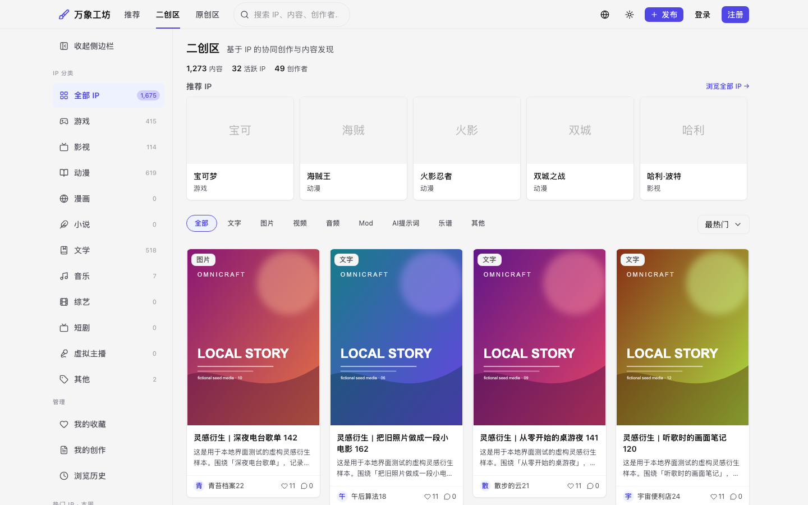

# OmniCraft

[](README.md)
[](README.zh-CN.md)


[](./LICENSE)
[](https://app.leeppp.online)

A community platform for original and fan creations — IP fan-work aggregation as the traffic foundation, agent automation as the value-add, and GitHub-style PR collaboration as the moat.

This is an **engineering-first, web-only open-source project that runs and tests locally**: a modular-monolith backend (Go/Gin) hosting a single-agent RAG workbench with permission filtering, server-side citation re-checking, degradable retrieval, and reliable async processing. Stack: Next.js + Go/Gin + PostgreSQL(pgvector) + Redis + Aliyun OSS/Green.

**Live demo**: [app.leeppp.online](https://app.leeppp.online) — browsable as a guest (single-server lean profile; no public operation, no real-user data).



---

## Core Capabilities

### 1. Agent/RAG retrieval pipeline

Content Q&A must satisfy relevance, version consistency, and permission boundaries simultaneously. The core trade-off: **treat the model as an untrusted source of suggestions — never as the source of authority or facts.**

```text
user question
  -> Agent ChatStream (server-side fixed tool registry)
  -> search_content tool
      ├─ PostgreSQL keyword recall (default read path)
      ├─ pgvector semantic recall
      └─ application-layer RRF fusion (OpenSearch BM25 projection
         contract ready, Phase 2 activation)
  -> content_version / index_generation / is_current re-check
  -> viewer-aware visibility filter
  -> RevalidateCitations server-side citation re-check
  -> SSE citation / done (the model can only answer from
     server-verified content)
```

- chunks are bound to `content_id/content_version/chunk_key/index_version`; retrieval, fusion, and re-validation all use this stable chunk identity;
- RRF avoids cross-engine score comparability problems; the top 20 candidates are re-checked in batch, backfilled one-by-one in rank order when fewer than that;
- citations never expose internal scores to the client; clients only consume server-generated `content_id/title/zone/route/chunk_key`.

### 2. Citation governance and the SSE streaming protocol

SSE admits only seven server-defined typed events (`start/tool_status/delta/citation/usage/done/error`): tool-call fragments are merged server-side by index and executed only after a full provider stream round; when the model fabricates title/route/version/source or a chunk key, `RevalidateCitations` drops it before output; cancellation, provider timeout, and storage errors use stable error codes — raw `err.Error()` is never leaked to the client.

### 3. Reliable async: Transactional Outbox / Worker / Inbox / DLQ

```text
business tx (state change + outbox_events committed in the same tx)
  -> relay, at-least-once delivery to Redis Streams
  -> standalone cmd/worker consumer
       (consumer_group, event_id) unique DB constraint for idempotency
       exponential-backoff retry -> permanent failure into DLQ
       -> admin replay
```

DB-internal side effects use `ConsumeInboxTx` (business write and inbox completion in one transaction); external side effects (moderation, embedding) must be idempotent themselves. The system is explicitly **at-least-once** — exactly-once is not claimed. Local failure drills cover duplicate delivery, lost ACKs, Redis stop/restart recovery, and DLQ replay.

### 4. Index generations and degradation

The index is a rebuildable projection, not the source of truth: rebuild goes staging → validation → atomic alias switch → promote PostgreSQL `is_current`; a failure keeps the old generation recoverable. Incremental projection and rebuild are guarded by a mutual lock. OpenSearch unavailability degrades to PG keyword; embedding-provider failure degrades to keyword-only — degraded results are explicitly labeled with their source.

### 5. Archive file security gate

Mod archives first pass application-layer streaming structural validation (path traversal / symlinks / encrypted entries / nested recursion / decompression quota — abort immediately on violation), then a ClamAV worker scan feeds a state machine and an append-only audit log. Publish and download are both clean-only gates; a quarantined object is never signed for download even if mislabeled.

### 6. End-to-end observability

OpenTelemetry W3C trace context spans HTTP → DB → LLM → SSE and Outbox → relay → Redis → Worker → Inbox (traceparent inside the outbox envelope); service-level names `omnicraft-server` / `omnicraft-worker`. Real traces from an authenticated MiniMax Chat sync path and an async embedding path have been captured, plus a collector-outage drill (losing observability does not affect the healthy business path).

---

## Real-provider evaluation (current-v1 frozen corpus)

Corpus and query set frozen (63 golden cases / 169 published contents·chunks / generation 2, corpus identity and golden-set checksum pinned), differential run with real MiniMax Chat + embo-01 embedding (2026-08-26):

| Metric (K=10) | Recall@10 | MRR | nDCG@10 | citation precision | P95 |
| --- | ---: | ---: | ---: | ---: | ---: |
| same-run chunk keyword baseline | 0.413 | 0.370 | 0.380 | — | — |
| **hybrid (keyword + pgvector + RRF)** | **0.492** | **0.437** | **0.450** | 0.170 | 164.8ms |

- visibility leak count `0`; degradation success rate `1.000`;
- a K=20 control (citation 0.162 / coverage 0.508) rules out Top-K truncation as the explanation;
- the historical 253-content baseline (citation precision 0.913) was audited for provenance: its corpus snapshot is unrecoverable and its counting口径 (content-level vs chunk-level) not comparable — it was honestly deprecated and a trustworthy baseline rebuilt. **No "improvement/regression" comparison is made.**

Agent answers, measured (same frozen corpus, 2026-08-29, 63-case real tool loop): **55/63 answered, 0 degradations, 0 provider errors**; SSE first-token P50 2078ms / P95 8259ms; average 3226 tokens per answer (two MiniMax streaming-usage defects were fixed along the way); citations average 4.2 per answer, all passing server-side re-validation. Groundedness/relevance use deterministic proxy metrics (saturated for paraphrasing models; a judge layer is a planned addition) and are not treated as quality conclusions.

## Evaluation infrastructure & the zero-cost PR gate (SP-22)

Retrieval-layer metrics are pure ID reconciliation (golden set vs retrieved IDs) with no provider calls — they finish in milliseconds, so they should not be an occasional report but **a gate that runs on every PR**.

- **PR-level zero-cost gate**: `evals/thresholds.yaml` defines `minimums` / `maximums` / `integrity` threshold sections; `backend/cmd/rag-gate` asserts against a frozen snapshot in under 0.1s locally. Red/green dual paths and exit 2 (configuration error) are empirically separated; the `integrity` section rejects empty/incomplete snapshots, closing the "empty snapshot, all green" hole.
- **196-case generation-layer baseline** (`label=sp22-e1-baseline-dev`, hybrid=on / expansion=off / rerank=off, 152/196 participating in the retrieval layer): context recall@10 0.9605, hit@5 0.9539, MRR 0.9138; refusal confusion matrix (answerable 176 / unanswerable 20): answerable accuracy 0.9545, over-refusal 0.0455, **hallucination rate 0.9000 — a located, unfixed observation item**; refusal accuracy 0.1000. Ragas-style generation-layer harness (judge=DeepSeek, 896 judge calls ≈1.41M tokens): faithfulness 0.792 / answer relevancy 0.716 / context precision 0.662 / noise sensitivity 0.021.
- **Judge calibration**: 18 cases × 3 reruns; faithfulness mean|Δ| 0.187, same-side rate 82.4%, Pearson 0.808; answer relevancy Pearson −0.174 — **gate eligibility for that metric was revoked accordingly** (observation only). Ground truth is model-labeled, not human-labeled.
- **Attribution grid**: a first 8-configuration sweep found `rrf_k` and candidate-pool size to be zero-sensitivity axes; rerank is the only all-metric positive-contribution cell (recall@10 0.9833→0.9917, MRR 0.9338→0.9833, latency +206ms).

> **Never mix the two baselines**: the differential baseline above = current-v1 frozen corpus, 63 cases, real providers (quality diagnosis); the snapshot baseline in this section = 196 ID-based zero-cost snapshots (regression gating). Always state which one, under which configuration, on which date. Evaluation drafts never enter the frozen set automatically — curation is manual.

## Runtime architecture


(Full technical design: [architecture.md](architecture.md).)

## Project phase and boundaries

A **single-server production deployment is complete** ([app.leeppp.online](https://app.leeppp.online) / api.leeppp.online, 3.6 GiB lean profile; runbook: [docs/deploy/single-server-beta-runbook.md](docs/deploy/single-server-beta-runbook.md), Status: PRODUCTION; deploy/rollback drill evidence archived under `artifacts/ops-08/`). **Deployed ≠ operating**: no public operation, no real users, no QPS/SLA data. Current defaults and boundaries:

- the default read path is PostgreSQL keyword/pgvector + RRF; `features.rag_hybrid_enabled=false` — the OpenSearch projection contract and degradation path are ready, and final activation is an explicit **Phase 2 decision** (isolated experiment: new generation + small corpus + no baseline-alias switch + recorded rollback point);
- `observability.tracing.enabled=false` (can be enabled via environment variables on demand); `archive_malware_scan_enabled` / `desktop_deploy_enabled` off by default;
- real MiniMax Chat/Embedding providers are integrated with local evidence; ClamAV is currently mostly a fake scanner plus protocol-level tests; no production QPS/SLA data;
- the Tauri desktop client has only completed the shutdown of its unsafe prototype (see the end of this file).

---

## Local development

### Prerequisites

| Tool | Version | Notes |
|------|---------|------|
| Go | 1.26+ | backend API (CI pins exactly 1.26.8, see `.github/workflows/ci.yml`) |
| Node.js | 20+ | frontend Next.js (CI pins Node 20; `engines` declares the minimum-version policy) |
| pnpm | 9+ (or npm 10+) | frontend package manager |
| PostgreSQL | 16+ | requires pgvector ≥ 0.7 |
| Redis | 7+ | cache and sessions |
| Rust | 1.75+ | only for the Tauri client |

Meeting the "minimum version" locally is enough; CI's exact toolchain is pinned separately by `.github/workflows/ci.yml` and `tauri-ci.yml` — do not conflate the two.

### 1. Clone the repository

```bash
git clone https://github.com/Leewwp/OmniCraft.git
cd OmniCraft
```

### 2. Start the infrastructure

```bash
# PostgreSQL + Redis (Docker)
docker compose up -d postgres redis
```

### 3. Initialize the database

```bash
chmod +x scripts/init-db.sh
./scripts/init-db.sh
```

Or run the migrations manually:

```bash
for f in backend/migrations/*.sql; do
  psql -h localhost -U omnicraft -d omnicraft -f "$f"
done
```

### 4. Configure environment variables

```bash
cp .env.example .env
# edit .env with your local development configuration
```

### 5. Start the backend

```bash
cd backend
go mod tidy
go run cmd/server/main.go
# API on http://localhost:8080
```

### 6. Start the frontend

```bash
cd frontend
pnpm install        # or npm install
pnpm dev            # or npm run dev
# frontend on http://localhost:3000
```

### 7. Project verification

The unified verification entry point stops on the first failing subcommand and returns a non-zero exit code to the caller.

```bash
# Default: daily deterministic engineering gate
bash scripts/verify-project.sh

# Full: Default + mocked Playwright contracts
bash scripts/verify-project.sh --full

# Release: Default + the full Playwright E2E suite
bash scripts/verify-project.sh --release
```

| Level | Coverage | Prerequisites |
|------|----------|----------|
| `default` | backend `test/vet/build`, frontend `unit/lint/build`, doc-validator tests and the strict `release` profile | Go, Node.js, locked dependencies installed |
| `full` | `default` + the mocked Playwright contract suite | Playwright browsers, PostgreSQL, Redis, and a startable local front/back configuration |
| `release` | `default` + desktop/mobile/mocked/cross-stack full Playwright suite | release-candidate configuration, Playwright browsers, PostgreSQL, Redis, test data, and the external services required by the plan |

`--full` and `--release` are mutually exclusive levels. `--tauri` is an additive dimension: add it when touching the desktop client; it can combine with `--full` or `--release`:

```bash
bash scripts/verify-project.sh --tauri
```

Archived-link debt stays visible but does not block the current release truth:

```bash
cd tools/doc-validator
go run . --check --profile archive
```

The aggregate command does not replace browser screenshots, real external-service smokes, Tauri installer verification, or manual release evidence required by tasks.

### 8. Continuous security scanning

The security gate runs as the stable `security-gate` job in `.github/workflows/security.yml` — on PRs, pushes to main, and daily on schedule. All scanning tools are version- or digest-pinned (see `security/pinned-tools.json`); floating references and `|| true` failure-hiding are forbidden (statically checked by `scripts/security/verify-pinned-actions.sh`).

```bash
# scan categories and exemption policy
bash scripts/security/verify-pinned-actions.sh
bash scripts/security/verify-security.sh -BuildImages -ReportDir artifacts/security

# contract tests (fake secret, expired exception, fragile lockfile each trip only their own gate)
bash scripts/security/verify-pinned-actions.tests.sh
bash scripts/security/verify-security.tests.sh
```

Coverage: Go `govulncheck`, frontend/tauri-client `npm audit`, Tauri `cargo audit`, gitleaks (worktree + full history), Trivy filesystem/IaC/container-image scans. Secret hits and release-Critical are non-waivable; a High waiver must live in `security/exceptions.json` (affected version/digest, compensating controls, an independent human approver, a commit-bound `approval_ref`, and an expiry). Until a second qualified human owner exists for this single-maintainer repository, `high_exceptions_enabled` stays `false` — every High must be fixed.

---

## Docker Compose deployment

### Local integration environment

The root `docker-compose.yml` is for local integration and is not the authority for public-server deployment. A public server must use `docs/deploy/docker-compose.single-server.yml` and `docs/deploy/single-server-beta-runbook.md`, exposing only 80/443 through Nginx.

```bash
# 1. configure environment variables
cp .env.example .env
# edit .env with production configuration

# 2. build and start
docker compose up -d --build

# 3. check status
docker compose ps
docker compose logs -f
```

### Core services

| Service | Port | Description |
|------|------|------|
| nginx | 80, 443 | reverse proxy + SSL termination |
| frontend | 3000 | Next.js SSR |
| backend | 8080 | Go API |
| postgres | 5432 | PostgreSQL 16 (pgvector) |
| pgbouncer | 6432 | DB connection pooler (host port 6432 → container 5432) |
| redis | 6379 | Redis 7 |
| migrate | none | one-shot forward migrations at release time, exits on success |

### The 3.6 GiB lean deployment profile

A resource-constrained low-end server keeps `nginx`, `frontend`, `backend`, `postgres`, `pgbouncer`, `redis`, and a trimmed `prometheus` resident; `migrate` runs and exits on each release. Prometheus scrapes only the backend's internal `:9091/metrics` — do not reuse the full configuration that requires Alertmanager, exporters, cAdvisor, Blackbox, and node-exporter.

This profile keeps structured logging, Docker log rotation, health/readiness checks, the metrics endpoint, and backup/restore, but defers Loki/Alloy/loki-gate and the full alerting chain. It is a web-only lightweight profile, not the full production-observability profile; the complete service list, resource conditions, and switchover gates live in the single-server runbook.

### Local address conventions

| Caller | Address | Purpose |
|------|------|------|
| browser → frontend | http://localhost:3000 | manual browsing and browser-side requests |
| browser → backend | http://localhost:8080 | browser-side API requests |
| Docker frontend SSR | http://backend:8080 | Next.js server-side rendering requests |
| Docker backend | in-container :8080 | mapped to host 8080 |

NEXT_PUBLIC_API_URL faces the browser and is baked in at frontend build time; INTERNAL_API_URL is only for the Next.js server runtime. The local Docker Compose configuration uses NEXT_PUBLIC_API_URL=http://localhost:8080 and INTERNAL_API_URL=http://backend:8080: the former serves the host browser, the latter serves in-container SSR. Do not use `backend` as NEXT_PUBLIC_API_URL — the browser cannot resolve Compose service names.

Local Compose maps two host ports (3000 frontend, 8080 API) for debugging convenience. In production users are not expected to access two ports; the production Compose publishes only Nginx's 80/443, with frontend and API exposed uniformly via the domain/reverse proxy. Because NEXT_PUBLIC_API_URL is baked into the browser bundle at build time, changing it requires rebuilding the frontend image.

### First deployment

1. **Configure SSL certificates** (Let's Encrypt):

```bash
# install certbot
apt-get install certbot

# issue certificates (standalone)
certbot certonly --standalone -d your-domain.com

# or Docker certbot
docker run -it --rm -v /etc/letsencrypt:/etc/letsencrypt \
  -v /var/lib/letsencrypt:/var/lib/letsencrypt \
  -p 80:80 certbot/certbot certonly --standalone -d your-domain.com
```

2. **Update nginx.conf**: replace `omnicraft.example.com` with the real domain

3. **Initialize the database**:

```bash
docker compose exec postgres psql -U omnicraft -d omnicraft -c "SELECT 1;"
# migrations run automatically on first container start via /docker-entrypoint-initdb.d
```

4. **Start services**:

```bash
docker compose up -d
```

### Production checklist

- [ ] all placeholders in `.env` replaced with real values
- [ ] SSL certificates configured (`/etc/letsencrypt/live/`)
- [ ] `server_name` in `nginx.conf` set to the real domain
- [ ] JWT_SECRET generated as a strong random key
- [ ] Aliyun OSS bucket created with access policy configured
- [ ] Aliyun content-safety (Green) service enabled
- [ ] scheduled DB backups configured (cron + `scripts/backup-db.sh`)
- [ ] firewall open on ports 80/443 only

---

## Environment variables

All variables are defined in `.env.example` (local development) and `.env.production.example` (production template; placeholders are rejected by preflight).

### Required

| Variable | Description | Example |
|------|------|------|
| `DB_DSN` | PostgreSQL connection string | `host=localhost port=5432 user=omnicraft password=... dbname=omnicraft sslmode=disable` |
| `REDIS_ADDR` | Redis address | `localhost:6379` |
| `JWT_SECRET` | JWT signing key (generate: `openssl rand -base64 64`) | — |
| `ALIYUN_ACCESS_KEY_ID` | Aliyun AccessKey (shared by OSS + content safety) | — |
| `ALIYUN_ACCESS_KEY_SECRET` | Aliyun AccessKey Secret | — |
| `OSS_ENDPOINT` | OSS endpoint | `https://oss-cn-hangzhou.aliyuncs.com` |
| `OSS_BUCKET_NAME` | OSS bucket name | `omnicraft-prod` |
| `GREEN_ACCESS_KEY_ID` | content-safety AccessKey (can share the OSS one) | — |
| `GREEN_ACCESS_KEY_SECRET` | content-safety AccessKey Secret | — |

### Optional

| Variable | Description | Default |
|------|------|--------|
| `DB_READ_DSN` | read-replica connection string (P1 phase) | empty → primary |
| `REDIS_PASSWORD` | Redis password | empty → none |
| `OSS_CDN_DOMAIN` | OSS CDN domain | empty → direct OSS |
| `AGENT_LLM_API_KEY` | LLM API key (DeepSeek / Qwen) | — |
| `AGENT_LLM_API_BASE` | LLM API base URL | `https://api.deepseek.com` |
| `AGENT_LLM_MODEL` | LLM model name | `deepseek-chat` |
| `AGENT_HMAC_SECRET` | compatibility build variable for the disabled desktop prototype; must not be used for production releases, replaced by Ed25519 configuration after D-03 | — |
| `GREEN_CALLBACK_URL` | content-safety callback URL | — |
| `FRONTEND_URL` | frontend URL (CORS/OAuth) | `http://localhost:3000` |
| `INTERNAL_API_URL` | in-container address for Next.js SSR → backend; may be empty for local processes | `http://backend:8080` (Docker) |

---

## Database initialization

```bash
# make sure PostgreSQL is running, then:
./scripts/init-db.sh

# custom connection:
DB_HOST=prod-db.example.com DB_PASSWORD=secret ./scripts/init-db.sh
```

Migrations live in `backend/migrations/`, executed in numbered order. Docker Compose runs them automatically on the first postgres container start.

### Collection / legacy-favorite reconciliation

After migration `058_create_collections.sql`, during the dual-write compatibility period for the legacy `favorites` table, run:

```bash
cd backend
DB_DSN="host=localhost port=5432 user=omnicraft password=... dbname=omnicraft sslmode=disable" \
  go run ./cmd/collection-reconcile
```

The command is read-only by default and reports, per user and per content, missing default sets, bidirectionally missing items, and logical duplicates; exit `0` on zero drift, `1` on drift, `2` on argument/connection/execution errors. After reviewing the report, an idempotent add-only repair can be applied:

```bash
# 1. first stop every backend instance that writes favorites / collection_items,
#    or enter an equivalent write-stopped maintenance window
# 2. run the repair on the same DB_DSN; explicit process env vars take
#    precedence over a .env in the working directory
go run ./cmd/collection-reconcile --apply --maintenance-window-confirmed
```

Without `--maintenance-window-confirmed`, `--apply` exits `2` before any database write. The confirmation asserts all application writers have stopped; merely rate-limiting traffic while favorite mutations remain allowed does not qualify. After the repair and a clean read-only re-check, backend instances may resume.

The legacy `favorites` write path may only be removed by a separate forward-cleanup plan and migration once **all** of the following hold:

1. every supported frontend and client build no longer calls the legacy favorite-mutation endpoints;
2. the reconciliation command has reported zero drift on seven consecutive daily checks;
3. no rollback-able release depends on the legacy table;
4. tests still pass with the recommender reading only `collection_items`;
5. removal is executed by a separate, reviewable forward-cleanup plan and migration.

---

## Database backups

```bash
# manual backup
./scripts/backup-db.sh

# keep the 7 most recent backups
./scripts/backup-db.sh --retain 7

# custom backup directory
BACKUP_DIR=/mnt/backups ./scripts/backup-db.sh
```

### Schedule backups (cron)

```bash
# edit crontab
crontab -e

# add: back up daily at 02:00, retain 30 days
0 2 * * * /path/to/OmniCraft/scripts/backup-db.sh >> /var/log/omnicraft-backup.log 2>&1
```

---

## SBOM and artifact attestation

Every release candidate produces CycloneDX SBOMs (Go modules, frontend/tauri npm, tauri Rust, container OS packages), bound to artifact digests, the migration manifest digest, and pinned generator versions. Generation, verification, and archiving are all locally reproducible; CI runs the same script set via `.github/workflows/sbom.yml` and produces GitHub provenance attestations for releases.

```bash
# 1. generate deterministic SBOMs and release-manifest.json
#    (builds missing container images automatically)
bash scripts/release/generate-sbom.sh -OutputDir artifacts/ops-06

# 2. verify the manifest schema, all digests, and provenance references
#    (-ImageDaemon additionally checks image OCI labels and commit binding)
bash scripts/release/verify-provenance.sh -Manifest artifacts/ops-06/release-manifest.json -ImageDaemon

# 3. archive the evidence and produce a machine-readable one-year retention
#    receipt (a real encrypted off-site destination requires Ops-08 credentials)
bash scripts/release/archive-release-evidence.sh -Manifest artifacts/ops-06/release-manifest.json -TargetDir /tmp/omnicraft-ops06-archive

# 4. contract tests
bash scripts/release/generate-sbom.tests.sh
bash scripts/release/verify-provenance.tests.sh
bash scripts/release/archive-release-evidence.tests.sh
```

- policy and schema: `release/sbom-policy.json`, `release/release-manifest.schema.json`
- determinism: generated SBOMs strip volatile fields like `metadata.timestamp` and `serialNumber` and never rewrite package identity
- release blockers: SBOM not bound to artifact digests, unpinned generators, provenance-identity mismatch, volatile image tags used as evidence

## Production release gate (Ops-08)

Production release candidates must pass configuration preflight and a staging deploy/rollback drill:

```bash
# 1. production config contract tests and preflight
#    (placeholders/defaults/non-HTTPS/unsafe flags/TLS policy/topology)
bash scripts/release/preflight.tests.sh
bash scripts/release/preflight.sh -EnvironmentFile /opt/omnicraft/.env -OverrideFile /var/lib/omnicraft/config_override.yaml -ReportDir artifacts/ops-08

# 2. deployment/rollback contract tests and the staging drill
#    (preflight -> deploy digest -> verify -> schema-compatible rollback -> redeploy)
bash scripts/release/deployment-contract.tests.sh
bash scripts/release/staging-drill.tests.sh
bash scripts/release/staging-drill.sh -EnvironmentFile "$OMNICRAFT_STAGING_ENV_FILE" -OverrideFile "$OMNICRAFT_STAGING_OVERRIDE_FILE" -CandidateManifest "$OMNICRAFT_CANDIDATE_MANIFEST" -PreviousManifest "$OMNICRAFT_PREVIOUS_MANIFEST" -ReportDir artifacts/ops-08
```

- images are referenced by immutable sha256 digest (`release/deployment-manifest.schema.json`); rollback rejects digests of unknown/incompatible schema and never runs destructive down SQL
- the release entrypoint `.github/workflows/release.yml` is manual-trigger only; the deploy job is bound to the GitHub Environment `production` protection
- when the real staging environment, OSS, or encrypted off-site archive credentials are missing, the drill blocks (exit 3) — simulated evidence is not a substitute
- production environment template: `.env.production.example` (placeholders rejected by preflight)

---

## Project structure

```
OmniCraft/
├── README.md                # this file (English)
├── README.zh-CN.md          # Chinese README
├── CONTRIBUTING.md          # contribution guide
├── SECURITY.md              # security policy and reporting
├── architecture.md          # technical architecture design
├── .env.example             # environment template (development)
├── .env.production.example  # environment template (production; placeholders rejected by preflight)
├── docker-compose.yml       # Docker Compose orchestration
├── nginx/
│   └── nginx.conf           # Nginx reverse-proxy configuration
├── scripts/
│   ├── init-db.sh           # database initialization
│   └── backup-db.sh         # database backup
├── backend/                 # Go backend
│   ├── cmd/server/main.go
│   ├── config/
│   ├── internal/
│   │   ├── handler/         # HTTP handlers
│   │   ├── service/         # business logic (agent_tools / agent_stream / rag / relay …)
│   │   ├── repository/      # data access
│   │   ├── model/           # GORM models
│   │   ├── middleware/      # middleware
│   │   └── pkg/             # utility packages (archivezip / clamav / llm / queue …)
│   ├── migrations/          # SQL migrations
│   ├── config.yaml          # application configuration
│   └── Dockerfile
├── frontend/                # Next.js frontend
│   ├── app/                 # App Router pages
│   ├── components/          # React components (agent/AgentCitationCard etc.)
│   ├── lib/
│   │   └── api.ts           # API request wrapper
│   └── Dockerfile
├── agent-access/            # external agent access (skill packages: search/download/publish)
├── tauri-client/            # Tauri desktop client
├── k8s/                     # K8s config (P2 placeholder)
└── design/
    ├── design-system.md     # design system (colors/type/spacing — the single design authority)
    └── ui-spec.md           # UI specification (pages and components)
```

---

## API documentation

```bash
# after starting the backend, hit the health check
curl http://localhost:8080/healthz

# the full API inventory lives in architecture.md §3.2
```

Main API paths:
- `/api/v1/auth/*` — authentication
- `/api/v1/contents/*` — content management
- `/api/v1/ips/*` — IP management
- `/api/v1/social/*` — social interactions
- `/api/v1/judge/*` — cyber judge
- `/api/v1/admin/*` — admin backend

---

## Tauri client

```bash
cd tauri-client

# install dependencies
pnpm install

# development
pnpm tauri dev

# production build
pnpm tauri build
```

The client integrates with the web frontend via the `omnicraft://` URL scheme. Only the shutdown of the unsafe prototype is complete in this repository (D-01); HMAC verification and direct WebView file commands remain the old, publish-forbidden implementation. `features.desktop_deploy_enabled` must stay `false` until D-02–D-05 and R-02 deliver the short-lived single-use grant, Ed25519 canonical script, strict Rust schema/path boundaries, native confirmation, and end-to-end security validation.
