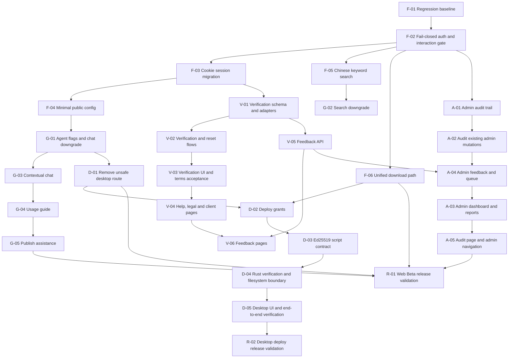

# OmniCraft Dual-Track Beta Roadmap

> **For agentic workers:** REQUIRED SUB-SKILL: Use superpowers:subagent-driven-development (recommended) or superpowers:executing-plans to implement this plan task-by-task. Steps use checkbox (`- [ ]`) syntax for tracking.

**Goal:** Turn the dual-track Beta design into a dependency-aware execution queue without mixing new Beta work into the historical `task.json`.

**Track Definitions:**
- **Track A** = Web Beta critical path: verification, admin operations, feedback, help/legal pages, search reliability, and download hardening.
- **Track B** = Agent feature path: chat, search enhancement, usage guide, and publish assistance.
- **Shared** = Cross-cutting security foundations required by both tracks (auth, session, config).

**Architecture:** `task.json` remains the historical MVP ledger. This roadmap and its linked subsystem plans are the source of truth for the 2026-05-30 public Beta hardening program. Implement one numbered task per session, update its checkbox and `progress.txt`, and commit code plus tracking updates together.

**Tech Stack:** Go/Gin/GORM/PostgreSQL/Redis backend, Next.js App Router frontend, Tauri 2/Rust desktop client, Docker Compose, MCP Playwright.

---

## Why This Is A Separate Plan Set

The design spans independent subsystems: authentication, feedback, admin operations, Agent UX, search, downloads, and an optional desktop security rebuild. Appending all work to `task.json` would mix public-Beta gates with the historical MVP ledger and overwrite an already-dirty file. Do not add Beta tasks to `task.json` unless a maintainer explicitly decides to migrate this plan set later.

Historical `passes: true` values are evidence of prior completion only. They do not waive the regression gates below, especially Tasks 156-168 from `task.json`.

## Plan Files

| Order | Plan | Scope | Required For Initial Web Beta |
|---|---|---|---|
| 1 | `docs/superpowers/plans/2026-05-30-omnicraft-beta-foundation.md` | regression baseline, fail-closed auth, cookie session migration, minimal public config, Chinese search, unified download | Yes |
| 2 | `docs/superpowers/plans/2026-05-30-omnicraft-beta-verification-feedback.md` | email/captcha adapters, account verification, terms acceptance, help/legal/client pages, feedback loop | Yes |
| 3 | `docs/superpowers/plans/2026-05-30-omnicraft-beta-admin-operations.md` | admin audit log, dashboard, reports, feedback, queue, navigation | Yes |
| 4 | `docs/superpowers/plans/2026-05-30-omnicraft-beta-agent-entrypoints.md` | public feature flags, chat/search downgrade, usage guide, upload assist, compliance confirmation | Yes |
| 5 | `docs/superpowers/plans/2026-05-30-omnicraft-beta-desktop-deploy-security.md` | mandatory prototype shutdown plus deploy grant, Ed25519 signing, Tauri command hardening and client flow | D-01 protects Web Beta; D-02 through D-05 and R-02 are required before the portfolio release advertises Desktop Agent/local execution |
| 6 | `docs/superpowers/plans/2026-05-30-omnicraft-beta-release-validation.md` | cross-stack release gates, external dependency checklist, browser evidence | Yes |

## Dependency Graph



## Execution Queue

| ID | Task | Plan | Depends On | Track | Status |
|---|---|---|---|---|---|
| F-01 | Re-run historical quality gates and capture baseline | foundation | - | Shared | `[x]` |
| F-02 | Make protected actions fail closed and centralize interaction eligibility | foundation | F-01 | Shared | `[x]` |
| F-03 | Move refresh session to HttpOnly cookie and remove browser-readable tokens | foundation | F-02 | Shared | `[x]` |
| F-04 | Add minimal public runtime config DTO and endpoint | foundation | F-03 | Shared | `[x]` |
| F-05 | Make Chinese keyword search reliable with trigram fallback and visibility filters | foundation | F-02 | Track A | `[x]` |
| F-06 | Route all attachment downloads through the authorized download API | foundation | F-02 | Track A | `[x]` |
| V-01 | Add verification schema, mail adapter, captcha adapter and config | verification-feedback | F-03 | Track A | `[x]` |
| V-02 | Implement verification, resend and reset token lifecycle | verification-feedback | V-01 | Track A | `[x]` |
| V-03 | Enforce verified-email restrictions and agreement acceptance in UI | verification-feedback | V-02 | Track A | `[x]` |
| V-04 | Add help, privacy, terms and client information pages | verification-feedback | V-03 | Track A | `[x]` |
| V-05 | Add feedback data model and user/anonymous API | verification-feedback | V-01 | Track A | `[x]` |
| V-06 | Add feedback pages and Footer/client entrypoints | verification-feedback | V-04, V-05 | Track A | `[x]` |
| A-01 | Add append-only admin audit log | admin-operations | F-02 | Track A | `[x]` |
| A-02 | Audit existing sensitive admin mutations | admin-operations | A-01 | Track A | `[x]` |
| A-03 | Add admin dashboard and reports pages | admin-operations | A-04 | Track A | `[x]` |
| A-04 | Add admin feedback and queue pages | admin-operations | A-02, V-05 | Track A | `[x]` |
| A-05 | Add audit-log page and complete admin navigation | admin-operations | A-03, A-04 | Track A | `[x]` |
| G-01 | Gate global Agent chat and deploy UI with public config | agent-entrypoints | F-04 | Track B | `[x]` |
| G-02 | Default anonymous search to keyword mode and downgrade Agent failures | agent-entrypoints | F-05, G-01 | Track B | `[x]` |
| G-03 | Make global chat contextual and recoverable | agent-entrypoints | G-01 | Track B | `[x]` |
| G-04 | Mount usage guide on content detail | agent-entrypoints | G-03 | Track B | `[x]` |
| G-05 | Mount user-confirmed publish assistance | agent-entrypoints | G-01 | Track B | `[x]` |
| D-01 | Remove the unsafe desktop deploy prototype route | desktop-deploy-security | G-01 | Shared Web Beta gate | `[x]` |
| D-02 | Add short-lived single-use deploy grants | desktop-deploy-security | D-01, F-06 | Desktop portfolio release | `[ ]` |
| D-03 | Replace HMAC with Ed25519 signed canonical scripts | desktop-deploy-security | D-02 | Desktop | `[ ]` |
| D-04 | Harden Rust schema, URL handling, filesystem and capabilities | desktop-deploy-security | D-03 | Desktop | `[ ]` |
| D-05 | Update desktop confirmation UI and run end-to-end tests | desktop-deploy-security | D-04 | Desktop | `[ ]` |
| R-01 | Run Web Beta release validation | release-validation | V-06, A-05, G-05, F-06, D-01 | Release | `[x]` |
| R-02 | Run desktop deploy release validation | release-validation | D-05 | Release | `[ ]` |

## Tracking Rules

- [ ] Pick the lowest ready unchecked task from the table above.
- [ ] Read its linked subsystem plan and the referenced `design/ui-spec.md` sections before editing UI.
- [ ] Implement only one numbered task per session.
- [ ] Before marking any task complete, run the repository-wide gates required by `AGENTS.md`: `go test ./...`, `go vet ./...`, `go build ./...`, `npm run lint`, `npm run build`, plus Playwright screenshots for UI changes and Rust gates for Tauri changes. Task-local commands are additional focused checks, not replacements.
- [ ] Update the checkbox in the subsystem plan and this roadmap row from `[ ]` to `[x]`.
- [ ] Append the required `progress.txt` entry.
- [ ] Keep code, plan checkbox, roadmap checkbox, and `progress.txt` in one commit.
- [ ] Do not modify `task.json` for this Beta program.
- [ ] If SMTP, captcha provider, OSS, Redis, PostgreSQL, Ed25519 private key, HTTPS certificate, or production origin configuration is unavailable at the task's required verification point, record the blocker and stop. Do not mark the task complete.

## Cross-Plan Contract Decisions

These decisions remove ambiguities discovered during plan review. Subsystem plans may add stricter rules but must not contradict them.

| Area | Frozen execution contract |
|---|---|
| Web Beta desktop posture | G-01 hides one-click deploy UI while the public flag is off. D-01 is mandatory for R-01 and removes the unsafe `/api/v1/agent/script/:id` prototype entirely. A Web-only Beta may run with D-02 through D-05 incomplete only when `features.desktop_deploy_enabled=false`; the portfolio release must not advertise Desktop Agent/local execution until D-02 through D-05 and R-02 pass. |
| Web Beta client distribution posture | Web Beta does not expose a desktop-client download. Keep `client.download_enabled=false`, omit download URL/version values from the public response when empty, and render `/client` as an unavailable/information state until a later client-release decision. |
| Production Web/API topology | The confirmed production Web origin is `https://app.leeppp.online`. The confirmed API origin is `https://api.leeppp.online`. F-03 must use API-host-only cookies, `SameSite=Lax`, `Secure`, strict `Origin` validation and credentialed CORS for only `https://app.leeppp.online`. |
| Captcha provider | Web Beta uses Alibaba Cloud CAPTCHA 2.0 behind the provider-agnostic `CaptchaVerifier` interface. Public config exposes only `provider`, `prefix`, `scene_id` and `region`. Server credentials remain private runtime configuration. Local development may use `bypass`; release mode must require `aliyun_v2`. |
| Public runtime config | Add a new allowlisted `/api/v1/config/public` DTO. Do not reuse the existing broad Admin `model.PublicConfig`. Map `agent.web_agent_enabled` into public `features.web_agent_enabled`; do not expose OSS CDN fields, TTLs, rate-limit internals or secrets. |
| Feedback routes | Public submission is `/feedback`; authenticated tracking is `/feedback/mine`; owned detail is `/feedback/[feedbackId]`. Do not create both `(public)/feedback/page.tsx` and `(protected)/feedback/page.tsx`, because both resolve to `/feedback`. |
| Feedback storage | Keep `feedback_tickets`, `feedback_replies` and `feedback_attachments` separate. Screenshot upload uses a feedback-specific presign endpoint and OSS prefix, never the content-upload prefix without purpose validation. |
| Search migration | Migration `047_pg_trgm_indexes.sql` already enables `pg_trgm` and creates trigram indexes for `content_items(title)`, `ips(name)`, `users(username)` and `tags(name)`. Migration `049_search_trigram_fallback.sql` adds the missing `content_tags(tag)` index and query-path changes; it must not pretend `pg_trgm` is absent. |
| Download API | `GET /api/v1/contents/:id/download?attachment_id=:attachmentId` returns JSON containing a short-lived URL. `attachment_id` is required for attachment-specific CTAs; omission is backward-compatible only when the handler can choose one unambiguous primary attachment. |
| Deploy grant exchange | `POST /api/v1/deploy-grants` requires normal Web authentication. `POST /api/v1/deploy-grants/exchange` intentionally accepts only an opaque grant from Tauri, is rate limited, atomically consumes the grant and rechecks authorization from persisted state. It does not require a Web JWT. |
| Deploy grant task boundary | D-02 implements grant issue plus atomic `Consume` and mounts only `POST /api/v1/deploy-grants`. D-03 adds signed-script generation and mounts `POST /api/v1/deploy-grants/exchange`, so each task compiles independently. |
| Signed desktop script | Sign exact canonical UTF-8 script bytes and return those same bytes as `script_json` with `signature` and `key_id`. Tauri verifies bytes before strict deserialization, avoiding cross-language JSON reserialization drift. Beta ships one active key ID; overlapping multi-key rotation requires an explicit maintainer decision. |
| Agent publish components | Reuse `frontend/components/agent/UploadAssistPanel.tsx` and `frontend/components/agent/ComplianceCheckBadge.tsx`. The similarly named `frontend/components/content/*` files are static content hints and are not substitutes for Agent suggestions. |

## New Config Field Registry

The Beta plans introduce the following `config.yaml` fields. This table is the authoritative registry for pre-merge review.

| Field | Plan | Section | Type | Default |
|-------|------|---------|------|---------|
| `oss.download_url_ttl_sec` | F-06 | oss | int | 300 |
| `features.desktop_deploy_enabled` | F-04 | features | bool | false |
| `web.public_base_url` | V-01 | web | string | "" |
| `smtp.mode` | V-01 | smtp | string | "logger" in local development only |
| `smtp.host` | V-01 | smtp | string | "" |
| `smtp.port` | V-01 | smtp | int | 587 |
| `smtp.user` | V-01 | smtp | string | "" |
| `smtp.password` | V-01 | smtp | string | "" |
| `smtp.from_address` | V-01 | smtp | string | "" |
| `captcha.provider` | F-04/V-01 | captcha | string | "bypass" in local development only; release uses "aliyun_v2" |
| `captcha.prefix` | F-04/V-01 | captcha | string | "" |
| `captcha.scene_id` | F-04/V-01 | captcha | string | "" |
| `captcha.region` | F-04/V-01 | captcha | string | "cn" |
| `captcha.access_key_id` | V-01 | captcha | string | "" |
| `captcha.access_key_secret` | V-01 | captcha | string | "" |
| `verification.email_ttl_sec` | V-01 | verification | int | 3600 |
| `verification.reset_ttl_sec` | V-01 | verification | int | 3600 |
| `verification.resend_cooldown_sec` | V-01 | verification | int | 60 |
| `verification.login_captcha_threshold` | V-01 | verification | int | 3 |
| `verification.password_min_length` | V-01 | verification | int | 8 |
| `deploy.grant_ttl_sec` | D-02 | deploy | int | 300 |
| `deploy.ed25519_private_key_b64` | D-03 | deploy | string | "" |
| `deploy.ed25519_key_id` | D-03 | deploy | string | "" |
| `agent.max_user_message_chars` | G-03 | agent | int | 4000 |
| `feedback.upload_grant_ttl_sec` | V-05 | feedback | int | 300 |
| `legal.current_terms_version` | V-02 | legal | string | "" |
| `legal.current_privacy_version` | V-02 | legal | string | "" |
| `client.download_enabled` | F-04 | client | bool | false |
| `client.download_url` | F-04 | client | string | "" |
| `client.latest_version` | F-04 | client | string | "" |

## Environment And Client Build Registry

These values are not `config.yaml` fields. Keep server runtime secret overrides and client build-time public settings separate.

| Variable | Plan | Consumer | Required Behavior |
|---|---|---|---|
| `DEPLOY_ED25519_PRIVATE_KEY_B64` | D-03 | backend runtime | Secret Ed25519 private-key override; never expose or log |
| `DEPLOY_ED25519_KEY_ID` | D-03 | backend runtime | Active server signing-key ID |
| `DEPLOY_PUBLIC_KEY_B64` | D-04 | Tauri build | Public Ed25519 key embedded in client |
| `DEPLOY_PUBLIC_KEY_ID` | D-04 | Tauri build | Must match the server key ID |
| `VITE_API_BASE_URL` | D-04 | Tauri WebView build | Confirmed HTTPS API base URL for release |
| `DEPLOY_ALLOWED_DOWNLOAD_HOSTS` | D-04 | Tauri build | Comma-separated exact OSS download hostnames |
| `DEPLOY_DOWNLOAD_TIMEOUT_SEC` | D-04 | Tauri build | Native download timeout; default `30` |
| `CAPTCHA_ACCESS_KEY_ID` | V-01 | backend runtime | Alibaba Cloud CAPTCHA 2.0 RAM AccessKey ID override; never expose in public config |
| `CAPTCHA_ACCESS_KEY_SECRET` | V-01 | backend runtime | Alibaba Cloud CAPTCHA 2.0 RAM AccessKey secret override; never expose or log |

## Cross-Plan File Conflict Matrix

Multiple files are modified by tasks in different plans. Use lowest-ready scheduling by default, serialize integration, and reserve shared write sets before allowing any implementation overlap. Each task must check the current file state before editing.

| File | Modifying Tasks | Conflict Mitigation |
|------|----------------|---------------------|
| `ContentDetail.tsx` | F-06, G-01, G-04, D-05 | Rebase onto the integrated branch before each dependent task; each task re-reads file before editing |
| `PublishForm.tsx` | G-01, G-05 | G-01 before G-05 |
| `routes.go` | F-02, F-03, F-04, V-02, V-05, A-02, A-04, A-05, D-01, D-02, D-03 | One active editor at a time; re-read the final route table and rerun route-mount tests after each integration |
| `config.go` / `config.yaml` | F-03, F-04, F-06, V-01, V-02, V-05, G-03, D-01, D-02, D-03 | One active editor at a time; use explicit struct fields and update the registry |
| `zh.json` / `en.json` | F-03, F-04, F-06, V-03, V-04, V-06, A-03, A-04, A-05, G-01, G-02, G-03, G-04, G-05, D-05 | Per-key merge; each task adds its own namespaced keys |
| `agent_service.go` | F-05, G-02, G-03, G-05, D-03 | Serialize edits; rebase and rerun focused Agent tests before integration |
| `frontend/app/admin/*` | A-04, then A-03 and A-05 consumers | A-04 owns the route-group move into `frontend/app/(protected)/admin/*`; later Admin tasks must not move the subtree again |

## Migration Numbering Note

The current migration directory uses free slots `049` through `052` for the new Beta migrations. Regardless of file creation history, execution must sort filenames lexically. R-01 Step 3 validates both an empty database and a reproducible upgrade database created by applying `001` through `048` before `049` through `052`.

## Design Coverage Matrix

| Design requirement | Owning tasks | Release proof |
|---|---|---|
| Fail-closed runtime auth, centralized interaction eligibility, in-memory access token and HttpOnly refresh cookie | F-02, F-03 | R-01 Steps 5-6 |
| Captcha, real mail, hashed single-use verification/reset tokens, pending verification UI and accepted agreement versions | V-01, V-02, V-03 | R-01 Steps 7-8 |
| Help, privacy, terms, client information, Footer and feedback entrypoints | V-04, V-06 | R-01 Step 8 |
| Feedback tickets, replies, screenshot attachments, diagnostic allowlist, user tracking, Admin reply/close and notifications | V-05, V-06, A-04 | R-01 Steps 7 and 9 |
| Admin dashboard, reports, feedback, queue, audit log, masked config and navigation | A-01 through A-05 | R-01 Step 9 |
| Agent feature gate, keyword-first search, failure downgrade, contextual chat, usage guide and confirmed publish suggestions | G-01 through G-05 | R-01 Steps 6 and 8 |
| Chinese title/tag substring fallback and shared content visibility scope | F-05, G-02 | R-01 Steps 6 and 8 |
| Authorized attachment downloads with short OSS URLs and asynchronous counting | F-06 | R-01 Steps 6 and 8 |
| Unsafe desktop prototype removed for Web Beta | D-01 | R-01 Steps 1, 6 and 10 |
| Optional secure desktop grant, Ed25519, strict schema, allowlisted filesystem and confirmation UX | D-02 through D-05 | R-02 |

## Deferred P1 Scope

Do not pull these into Beta tasks: full collection model, announcement editor, messaging SSE expansion, notification SSE expansion, Agent tool dispatcher, autonomous local actions, DLQ replay, full RBAC, 2FA, third-party OAuth, or payment.

## Non-Blocking Beta Follow-Ups

After R-01, schedule separately if capacity remains: `/reports/me`, anonymous feedback status links backed by hashed high-entropy tokens, stronger empty-state CTAs, download-failure client-install guidance, optional feedback status emails for logged-in users, and richer dashboard trends.

## Confirmed Maintainer Decisions

Confirmed on 2026-05-31:

| Decision | Confirmed value | Effect |
|---|---|---|
| Production Web origin | `https://app.leeppp.online` | F-03 may freeze cookie, CSRF and CORS behavior against this exact Web origin. |
| Production API origin | `https://api.leeppp.online` | F-03 uses API-host-only refresh and CSRF cookies. |
| Captcha provider | Alibaba Cloud CAPTCHA 2.0 | F-04/V-01 use the `aliyun_v2` provider contract while preserving a provider-agnostic service interface. |
| 2026-07-16 portfolio desktop posture | Desktop Agent is a required portfolio capability, but remains disabled until safe | Keep `features.desktop_deploy_enabled=false`; execute D-02 through D-05 and R-02 before advertising download/config automation. No unsafe demo exception. |

## Remaining Human Decisions Required Before Execution

Do not guess these values during implementation:

| Decision | Blocks | Required maintainer answer |
|---|---|---|
| Approved legal copy and versions | V-02, V-04, R-01 | Provide the approved `/terms` and `/privacy` static content plus the exact `legal.current_terms_version` and `legal.current_privacy_version` identifiers. Do not invent legal text or release version values. |
| Desktop key rotation posture | Deferred: D-04/R-02 only when desktop deploy is advertised later | Is one active Ed25519 key per client release sufficient, or must the client accept an overlapping old/new keyring during rotation? |
| Desktop production network allowlist | Deferred: D-04/R-02 only when desktop deploy is advertised later | Provide the final HTTPS API base URL and exact OSS download hostnames to embed in the Tauri release build and CSP. |

## Commit Convention

Use one commit per roadmap task:

```bash
git add <exact task files> docs/superpowers/plans progress.txt
git commit -m "Beta <ID>: <task title> - completed"
```
