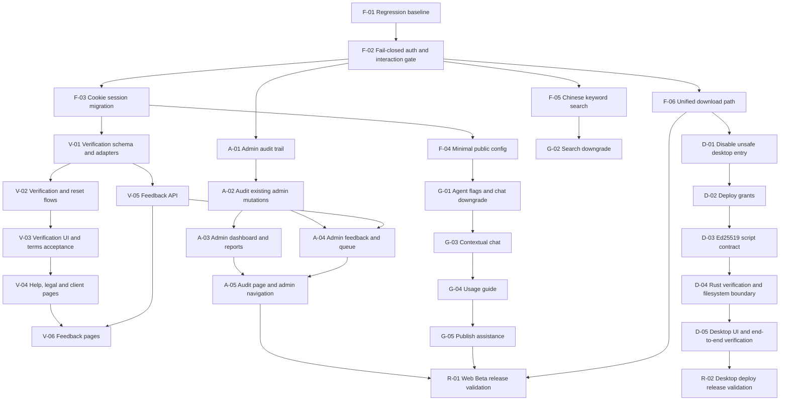

# OmniCraft Dual-Track Beta Roadmap

> **For agentic workers:** REQUIRED SUB-SKILL: Use superpowers:subagent-driven-development (recommended) or superpowers:executing-plans to implement this plan task-by-task. Steps use checkbox (`- [ ]`) syntax for tracking.

**Goal:** Turn the dual-track Beta design into a dependency-aware execution queue without mixing new Beta work into the historical `task.json`.

**Architecture:** `task.json` remains the historical MVP ledger. This roadmap and its linked subsystem plans are the source of truth for the 2026-05-30 public Beta hardening program. Implement one numbered task per session, update its checkbox and `progress.txt`, and commit code plus tracking updates together.

**Tech Stack:** Go/Gin/GORM/PostgreSQL/Redis backend, Next.js App Router frontend, Tauri 2/Rust desktop client, Docker Compose, MCP Playwright.

---

## Why This Is A Separate Plan Set

The design spans independent subsystems: authentication, feedback, admin operations, Agent UX, search, downloads, and an optional desktop security rebuild. Appending all work to `task.json` would mix public-Beta gates with the historical MVP ledger and overwrite an already-dirty file. Do not add Beta tasks to `task.json` unless a maintainer explicitly decides to migrate this plan set later.

Historical `passes: true` values are evidence of prior completion only. They do not waive the regression gates below, especially Tasks 156-168 from `task.json`.

## Plan Files

| Order | Plan | Scope | Required For Initial Web Beta |
|---|---|---|---|
| 1 | `docs/superpowers/plans/2026-05-30-omnicraft-beta-foundation.md` | regression baseline, fail-closed auth, cookie session migration, minimal public config, Chinese search, unified download | Yes |
| 2 | `docs/superpowers/plans/2026-05-30-omnicraft-beta-verification-feedback.md` | email/captcha adapters, account verification, terms acceptance, help/legal/client pages, feedback loop | Yes |
| 3 | `docs/superpowers/plans/2026-05-30-omnicraft-beta-admin-operations.md` | admin audit log, dashboard, reports, feedback, queue, navigation | Yes |
| 4 | `docs/superpowers/plans/2026-05-30-omnicraft-beta-agent-entrypoints.md` | public feature flags, chat/search downgrade, usage guide, upload assist, compliance confirmation | Yes |
| 5 | `docs/superpowers/plans/2026-05-30-omnicraft-beta-desktop-deploy-security.md` | deploy grant, Ed25519 signing, Tauri command hardening, client flow | Conditional: required before advertising one-click deploy |
| 6 | `docs/superpowers/plans/2026-05-30-omnicraft-beta-release-validation.md` | cross-stack release gates, external dependency checklist, browser evidence | Yes |

## Dependency Graph



## Execution Queue

| ID | Task | Plan | Depends On | Track | Status |
|---|---|---|---|---|---|
| F-01 | Re-run historical quality gates and capture baseline | foundation | - | Shared | `[ ]` |
| F-02 | Make protected actions fail closed and centralize interaction eligibility | foundation | F-01 | Shared | `[ ]` |
| F-03 | Move refresh session to HttpOnly cookie and remove browser-readable tokens | foundation | F-02 | Shared | `[ ]` |
| F-04 | Add minimal public runtime config DTO and endpoint | foundation | F-03 | Shared | `[ ]` |
| F-05 | Make Chinese keyword search reliable with trigram fallback and visibility filters | foundation | F-02 | Track A | `[ ]` |
| F-06 | Route all attachment downloads through the authorized download API | foundation | F-02 | Track A | `[ ]` |
| V-01 | Add verification schema, mail adapter, captcha adapter and config | verification-feedback | F-03 | Track A | `[ ]` |
| V-02 | Implement verification, resend and reset token lifecycle | verification-feedback | V-01 | Track A | `[ ]` |
| V-03 | Enforce verified-email restrictions and agreement acceptance in UI | verification-feedback | V-02 | Track A | `[ ]` |
| V-04 | Add help, privacy, terms and client information pages | verification-feedback | V-03 | Track A | `[ ]` |
| V-05 | Add feedback data model and user/anonymous API | verification-feedback | V-01 | Track A | `[ ]` |
| V-06 | Add feedback pages and Footer/client entrypoints | verification-feedback | V-04, V-05 | Track A | `[ ]` |
| A-01 | Add append-only admin audit log | admin-operations | F-02 | Track A | `[ ]` |
| A-02 | Audit existing sensitive admin mutations | admin-operations | A-01 | Track A | `[ ]` |
| A-03 | Add admin dashboard and reports pages | admin-operations | A-02 | Track A | `[ ]` |
| A-04 | Add admin feedback and queue pages | admin-operations | A-02, V-05 | Track A | `[ ]` |
| A-05 | Add audit-log page and complete admin navigation | admin-operations | A-03, A-04 | Track A | `[ ]` |
| G-01 | Gate global Agent chat and deploy UI with public config | agent-entrypoints | F-04 | Track B | `[ ]` |
| G-02 | Default anonymous search to keyword mode and downgrade Agent failures | agent-entrypoints | F-05, G-01 | Track B | `[ ]` |
| G-03 | Make global chat contextual and recoverable | agent-entrypoints | G-01 | Track B | `[ ]` |
| G-04 | Mount usage guide on content detail | agent-entrypoints | G-03 | Track B | `[ ]` |
| G-05 | Mount user-confirmed publish assistance | agent-entrypoints | G-01 | Track B | `[ ]` |
| D-01 | Hide unsafe desktop deploy until secure grant flow is enabled | desktop-deploy-security | F-04, F-06 | Desktop | `[ ]` |
| D-02 | Add short-lived single-use deploy grants | desktop-deploy-security | D-01 | Desktop | `[ ]` |
| D-03 | Replace HMAC with Ed25519 signed canonical scripts | desktop-deploy-security | D-02 | Desktop | `[ ]` |
| D-04 | Harden Rust schema, URL handling, filesystem and capabilities | desktop-deploy-security | D-03 | Desktop | `[ ]` |
| D-05 | Update desktop confirmation UI and run end-to-end tests | desktop-deploy-security | D-04 | Desktop | `[ ]` |
| R-01 | Run Web Beta release validation | release-validation | V-06, A-05, G-05, F-06 | Release | `[ ]` |
| R-02 | Run desktop deploy release validation | release-validation | D-05 | Release | `[ ]` |

## Tracking Rules

- [ ] Pick the lowest ready unchecked task from the table above.
- [ ] Read its linked subsystem plan and the referenced `design/ui-spec.md` sections before editing UI.
- [ ] Implement only one numbered task per session.
- [ ] Update the checkbox in the subsystem plan and this roadmap row from `[ ]` to `[x]`.
- [ ] Append the required `progress.txt` entry.
- [ ] Keep code, plan checkbox, roadmap checkbox, and `progress.txt` in one commit.
- [ ] Do not modify `task.json` for this Beta program.
- [ ] If SMTP, captcha provider, OSS, Redis, PostgreSQL, Ed25519 private key, HTTPS certificate, or production origin configuration is unavailable at the task's required verification point, record the blocker and stop. Do not mark the task complete.

## Deferred P1 Scope

Do not pull these into Beta tasks: full collection model, announcement editor, messaging SSE expansion, notification SSE expansion, Agent tool dispatcher, autonomous local actions, DLQ replay, full RBAC, 2FA, third-party OAuth, or payment.

## Non-Blocking Beta Follow-Ups

After R-01, schedule separately if capacity remains: `/reports/me`, stronger empty-state CTAs, download-failure client-install guidance, feedback status email notifications, and richer dashboard trends.

## Commit Convention

Use one commit per roadmap task:

```bash
git add .
git commit -m "Beta <ID>: <task title> - completed"
```
