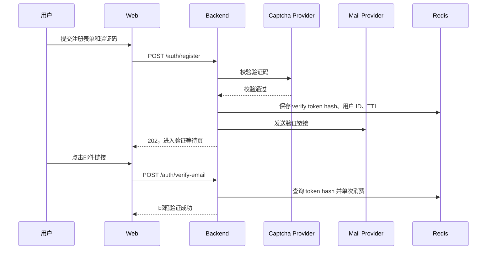
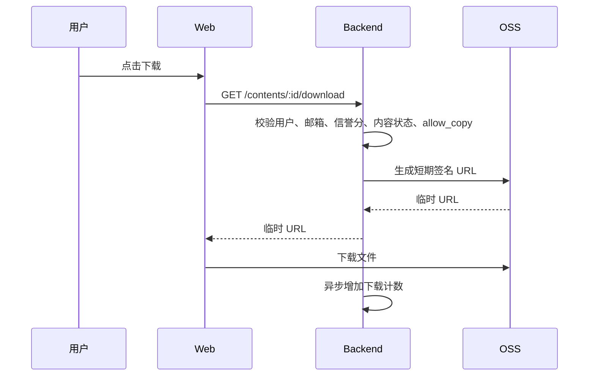
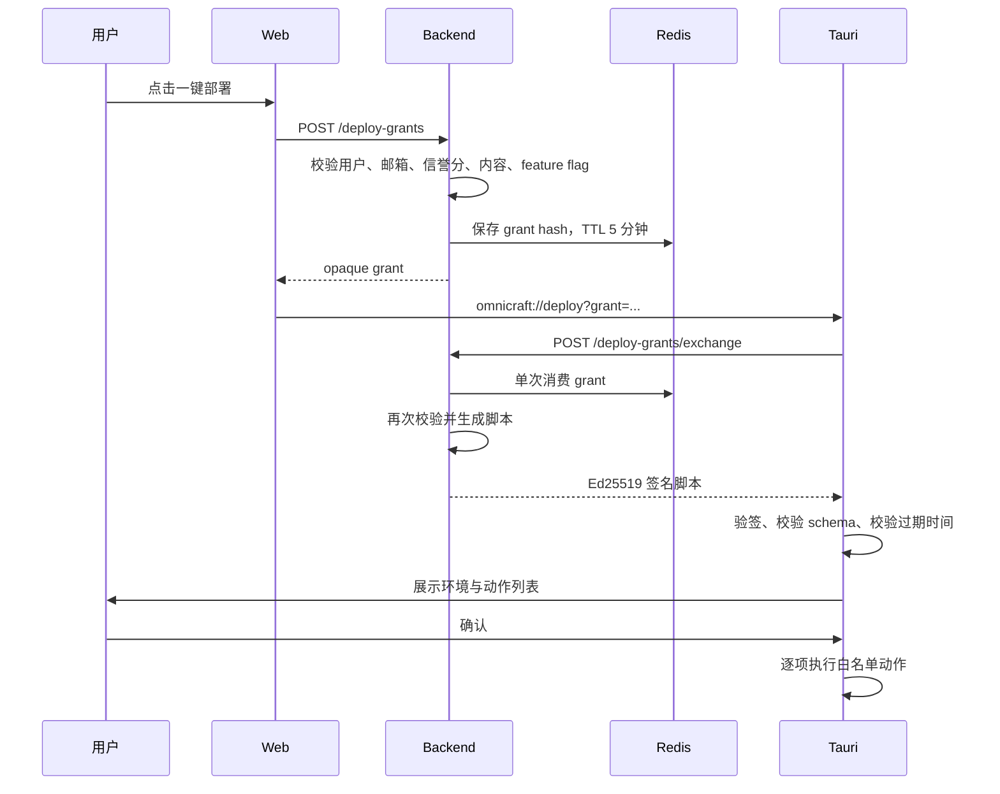
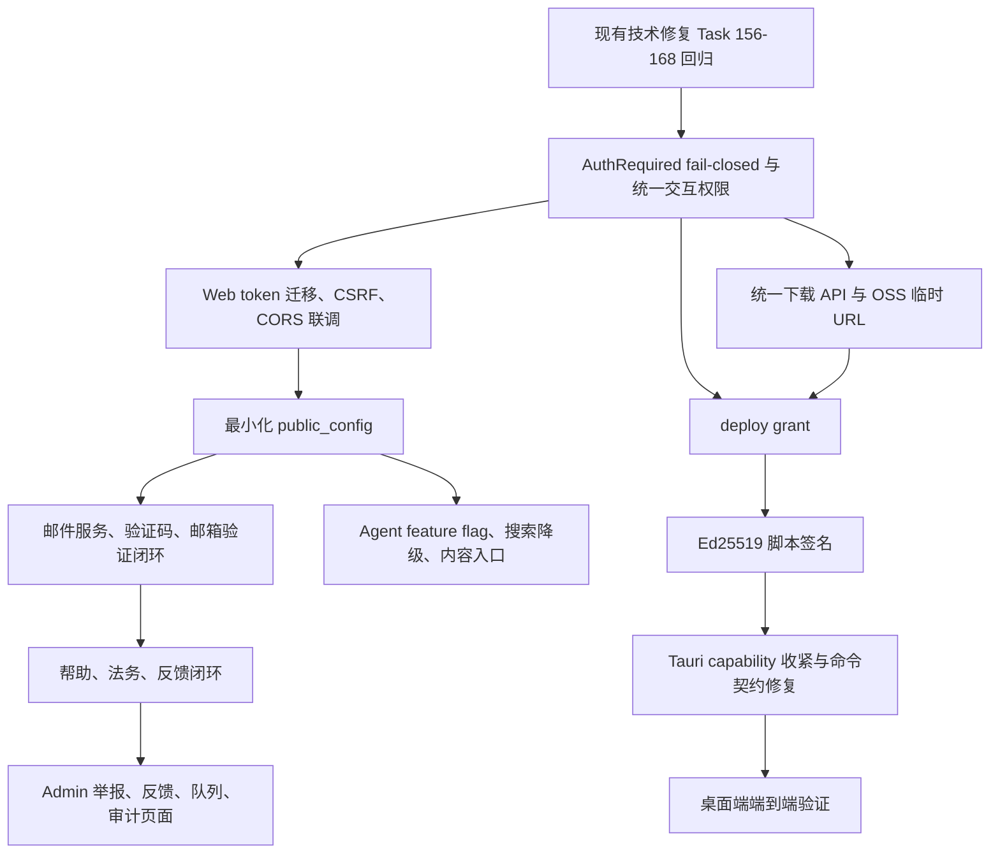

# OmniCraft 双轨 Beta 完整 Brainstorming 设计

> 日期：2026-05-30
> 状态：已完成 brainstorming，等待后续独立会话执行 writing-plans
> 用途：这是本轮产品审阅、技术审阅和安全自检的完整交接文档。后续 AI 不应依赖原始聊天记录，应以本文档作为新增功能规划的主要输入，并在实现前再次核验代码现状。
> 限制：本文档不是 implementation plan，不拆分任务，不修改现有 `task.json`。

## 1. 文档目标

OmniCraft 已完成较大范围 MVP 开发。本轮工作不是重新设计产品，也不是立即实现功能，而是全面审阅：

1. 哪些页面、入口和闭环仍然缺失。
2. 哪些已有功能只是占位或开发态实现，尚不能进入公开 Beta。
3. 管理后台还缺少哪些运营和配置能力。
4. 账号、安全、反馈、Agent 和桌面端部署链路的风险边界是否清晰。
5. 哪些能力必须纳入 Beta，哪些能力应延后到 P1。
6. 后续 writing-plans 会话必须掌握哪些依赖、验收门槛和禁止事项。

本轮最终采用“双轨 Beta”方案：

- **轨道 A：社区可信度与可运营性。** 完成账号安全、反馈闭环、管理后台、举报与队列可视化、帮助和法务页面。
- **轨道 B：Agent 差异化体验。** 为普通用户提供直观、低风险、可降级的站内助手入口；保留桌面端一键部署方向，但公开启用前必须重构授权与签名链路。

两条轨道共享同一条底线：任何功能都不能绕过认证、信誉分、封禁状态、内容可见性、OSS 临时授权和本地文件白名单。

## 2. 已确认的产品判断

### 2.1 目标阶段

当前目标不是“内部演示可运行”，而是“可邀请普通用户参加公开 Beta”。因此优先级必须从功能数量转向：

- 用户是否能够理解入口。
- 核心路径是否有错误恢复。
- 管理员是否能够处理用户问题。
- 账号和本地客户端是否具备基本安全边界。
- 功能开关关闭时，前端是否同步隐藏或降级。
- 外部服务不可用时，系统是否安全失败。

### 2.2 核心价值

OmniCraft 不应只被表达成内容社区，也不应只被表达成 Agent 工具。产品核心是：

> 普通用户可以发现、理解、收藏、下载和使用创意内容；创作者可以发布和维护内容；Agent 在站内帮助用户降低理解和操作门槛，但不能替代权限系统，也不能未经确认执行高风险操作。

### 2.3 已讨论但未采用的方案

#### 方案 1：双轨 Beta，已采用

同时补齐社区可信闭环和 Agent 普通用户入口。优点是既能让平台可运营，也保留差异化体验。缺点是必须控制范围，否则容易变成多个大系统同时重做。

#### 方案 2：社区能力优先

先只做账号、反馈、后台和内容闭环，暂缓 Agent。优点是交付风险低；缺点是 Beta 缺少明显差异化能力。

#### 方案 3：Agent 能力优先

优先把 Agent 和桌面端部署做成主线。优点是展示效果强；缺点是安全、客户端契约和运营能力不足时，不适合公开 Beta。

选择方案 1 的前提是：Agent Beta 范围必须收敛为“受控站内助手”，桌面端部署必须在安全重构完成前保持关闭。

## 3. 审阅范围与证据来源

本轮已阅读和检索以下材料：

- `AGENTS.md`
- `architecture.md`
- `task.json`
- `progress.txt`
- `OmniCraft（万象工坊）V0.3 正式版产品需求文档.md`
- `design/ui-spec.md`
- `design/design-system.md`
- `UI Design.md`（已归档至 `docs/archive/`，仅作历史参考）
- `docs/PLAN.md`
- `docs/async-queue-analysis.md`
- `docs/review/frontend-audit-2026-05-22.md`
- `docs/review/security-audit-2026-05-22.md`
- `docs/review/backend-api-audit-2026-05-22.md`
- `docs/review/db-devops-perf-review-2026-05-22.md`
- `docs/review/e2e-testing-report-2026-05-22.md`
- `docs/review/search-recommendation-agent-verification.md`
- 后端路由、中间件、认证 handler、Agent service、配置结构、队列实现
- 前端路由、Root Layout、Footer、Agent 组件、搜索页、内容详情页、设置页、Admin 页面
- Tauri 客户端 App、URL Scheme、签名校验、文件操作命令、capabilities 配置
- 最近 git 提交

### 3.1 文档和任务清单注意事项

`task.json` 使用 Node.js 按 UTF-8 读取时是有效 JSON。PowerShell 当前默认解码链路可能产生乱码，因此后续自动化工具读取 `task.json` 时必须显式使用 UTF-8 安全解析器，不能根据终端乱码误判文件损坏。

`task.json` 中的 `passes: true` 不能自动证明生产闭环真实可用。例如密码重置和邮箱验证页面已经存在，但邮件发送、验证码、token 脱敏和生产配置仍不完整。后续 writing-plans 必须按代码现状核验，不得仅按任务状态推断。

### 3.2 已存在但仍需回归的技术修复清单

`task.json` 中 Task 156 至 Task 168 仍需作为技术质量门槛处理。它们覆盖：

| Task | 范围 |
|---|---|
| 156 | Redis ZSet 内存回收、TTL 配置化、Goroutine 安全 |
| 157 | Config override、一致性、Docker 健康检查、OptionalAuth |
| 158 | 前端阴影规范、OriginalSidebar 硬编码搜索词 |
| 159 | 安全、数据库、搜索修复的集成验证 |
| 160 | AgentConfig、PublishConfig、`.env.example` |
| 161 | Redis key 规范化、推荐引擎参数配置化 |
| 162 | Docker、Nginx、SSL 加固 |
| 163 | `pg_trgm` 索引和排序计算列 |
| 164 | CSRF 随机数检查、Agent 孤立记录清理、向量日志 |
| 165 | Rehab 组件拆分、命名对齐、console 清理 |
| 166 | E2E 残留 API 修复 |
| 167 | 数据库迁移注释 |
| 168 | 第二轮集成验证 |

Task 169 的代码审查已经记录为完成，但它不能替代上述集成验证，也不覆盖本轮新增发现。

## 4. 当前产品现状分类

后续 AI 应区分以下五类状态：

1. **已有且基本可用。**
2. **已有 UI 或 API，但闭环不完整。**
3. **存在组件或设计稿，但没有挂载到用户路径。**
4. **完全缺失。**
5. **有实现但存在安全风险，公开 Beta 前必须关闭或重构。**

### 4.1 已有且基本可用的主要能力

- 注册、登录、JWT、刷新、退出基础接口。
- 内容发布、详情、分类、搜索、推荐、评论、互动、举报、众裁基础能力。
- 创作者工作室 `/studio/*` 路由和主要页面。
- 用户主页、设置、消息、通知基础页面。
- 管理端 IP、内容、用户、申诉、分类、配置、LLM 配置页面。
- 下载 API：`GET /api/v1/contents/:id/download`。
- Admin 举报 API：`GET /api/v1/admin/reports`、`PATCH /api/v1/admin/reports/:id`、`GET /api/v1/admin/reports/stats`。
- Admin 队列 API：`GET /api/v1/admin/queue/stats`、`GET /api/v1/admin/queue/dlq`。
- Agent 搜索、聊天、上传辅助、合规提示、使用指南、脚本生成等后端能力的初步实现。
- Tauri 的 7 类文件操作命令骨架、URL Scheme 和本地确认界面。

### 4.2 已有但闭环不完整的能力

| 能力 | 当前问题 |
|---|---|
| 邮箱验证 | 后端生成 token，但开发态直接返回 token；没有真实邮件发送；前端要求手动粘贴 token；TTL 使用疑似互换；没有验证码和重发冷却 |
| 密码重置 | 后端生成 token，但开发态直接返回 token；没有真实邮件发送；TTL 使用邮箱验证 TTL；密码最低长度仍偏低 |
| Admin 配置 | 已有脱敏 Admin 配置 DTO，但普通用户侧缺少最小化公共配置接口 |
| Agent 开关 | 后端读取 `web_agent_enabled`，但前端 Root Layout 中的聊天浮窗未根据公共配置隐藏 |
| Agent 聊天 | 前端浮窗存在，但每次只发送当前一条消息；缺少页面上下文、快捷问题和稳定降级 |
| Agent 搜索 | 搜索页存在 Agent 搜索组件，但公开页面默认选择 Agent 模式；匿名用户可能直接命中受保护接口失败 |
| 下载 | 后端有统一下载 API，但内容详情仍存在直接使用附件 `oss_url` 的链接，可能绕过下载权限和计数 |
| Admin 举报和队列 | API 已存在，但 Admin 导航和页面没有形成完整运营入口 |
| Footer | 已有“帮助、隐私、协议”等文案，但链接仍指向 `/` |

### 4.3 已有组件但未挂载

以下 Agent 组件存在代码定义，但检索中未发现完整挂载到用户流程：

- `frontend/components/agent/UsageGuidePanel.tsx`
- `frontend/components/agent/UploadAssistPanel.tsx`
- `frontend/components/agent/ComplianceCheckBadge.tsx`

后续实现应优先复用这些组件和已有 API，不要重复创建近似组件。

### 4.4 完全缺失或明显不足

- `/help`
- `/feedback`
- 登录用户反馈列表和详情
- `/privacy`
- `/terms`
- `/client`
- `/admin/dashboard`
- `/admin/reports`
- `/admin/feedback`
- `/admin/queue`
- `/admin/audit-logs`
- 用户侧举报进度入口，例如 `/reports/me`
- 真实邮件服务适配层
- 验证码服务适配层
- Admin 操作审计日志
- 安全的 deploy grant 模型
- 桌面端非对称签名验证
- 严格的 Agent 公共配置 DTO

### 4.5 已存在但必须关闭或重构

桌面端“一键部署”当前不可作为公开 Beta 能力。原因不是单一缺陷，而是链路整体不满足安全和可用性要求：

- Web 深链只包含 `content_id`，没有安全授权票据。
- Tauri 客户端使用硬编码 `http://localhost:8080/api/v1`。
- HMAC secret 编译进桌面客户端，可被逆向提取。
- 服务端脚本生成未完整重新校验用户、内容状态、`allow_copy`、`agent_enabled` 和邮箱验证状态。
- 脚本中的附件 URL 使用 OSS Key 或非统一授权 URL，不保证可下载。
- 脚本 payload 使用 `dest`、`path` 等字段，而 Rust command 接收 `dest_path`、`archive_path`、`dest_dir` 等参数，契约不一致。
- Rust 白名单校验对尚未创建的新目标路径处理不完整。
- 生成脚本包含相对路径，不能可靠映射到白名单目录。
- Tauri WebView capabilities 仍直接开放多项文件系统权限，超出“只允许 7 类命令”的业务边界。

## 5. Beta 范围冻结

### 5.1 Beta 必须完成

#### A. 账号和认证安全闭环

- 注册时创建待验证账号，不直接发放完整可交互会话。
- 注册、忘记密码、重发验证邮件前增加验证码。
- 登录在达到失败阈值后增加验证码，降低普通用户摩擦。
- 接入真实邮件服务。
- 邮箱验证 token 和密码重置 token 不得出现在生产响应中。
- Redis 只保存 token hash，token 单次使用，验证成功后立即删除。
- 修正邮箱验证和密码重置 TTL 的配置使用。
- 未验证邮箱用户不能执行发布、评论、互动、众裁、下载、Agent 和桌面端授权操作。
- 设置页展示邮箱验证状态和重发入口。
- 注册时记录用户接受的协议版本和接受时间。
- 受保护接口在无法确认用户实时状态时 fail-closed。

#### B. 用户反馈和帮助闭环

- `/help`
- `/feedback`
- 登录用户反馈列表和详情
- `/admin/feedback`
- Footer 正确链接到帮助、隐私、协议和反馈入口
- Web 和桌面端提供明确反馈入口

#### C. Admin 基础运营闭环

- `/admin/dashboard`
- `/admin/reports`
- `/admin/feedback`
- `/admin/queue`
- `/admin/audit-logs`
- Admin 侧边栏补齐入口
- 队列页面 Beta 阶段默认只读
- 配置页仅展示密钥“已配置”状态或掩码，不能回显敏感值

#### D. 普通用户可理解的 Agent 入口

- 全局聊天助手，但必须受公共 feature flag 控制。
- 搜索增强，但匿名用户默认普通关键词搜索。
- 内容详情页使用指南入口。
- 发布页上传辅助和合规提示，输出必须由用户确认后应用。
- Agent 失败时可回退到普通搜索、普通下载或帮助页面。

#### E. 下载链路统一

- 所有内容下载都经过 `GET /api/v1/contents/:id/download`。
- 前端不再使用附件直链作为下载主路径。
- 下载前重新检查内容状态、用户封禁状态、邮箱验证状态和信誉分。
- OSS 仅返回短期签名 URL。

#### F. 中文关键词搜索可靠性

- 普通关键词搜索是 Agent 搜索的降级路径，必须在 Beta 中可靠可用。
- 已有审计指出 `to_tsvector('simple', ...)` 对无空格中文分词不足，不能只依赖 `tsvector`。
- writing-plans 必须核验实际查询路径，并使用适合中文关键词的策略，例如 `pg_trgm`、前缀查询或明确的分词方案。
- 关键词搜索和 AI 搜索都必须经过相同的内容可见性过滤。

### 5.2 若继续宣传桌面端，则属于 Beta 必须完成

桌面端能力可以保留为产品差异化方向，但只有在第 12 节安全设计完成并通过端到端验收后才能公开展示“一键部署”按钮。

如果暂时不实现该重构：

- 前端隐藏一键部署入口。
- `/client` 页面可以保留为预告或下载说明页。
- 不能把现有链路标记为 Beta 可用。

### 5.3 Beta 推荐完成，但不阻塞首轮开放

- 用户侧 `/reports/me`，查看自己举报的处理状态。
- 更完善的空状态 CTA。
- 内容详情页和下载失败页的客户端安装引导。
- 反馈工单状态邮件提醒。
- Admin 首页的基础趋势统计。

### 5.4 延后到 P1

- 完整收藏集模型：`collections`、`collection_items`、公开收藏集页面、收藏集筛选。
- Admin 公告编辑器和公告管理页。
- 消息中心 SSE 实时化。
- 通知中心 SSE 实时化。
- Agent 多轮历史持久化和跨页面会话恢复。
- Agent 自由工具调用框架。
- Agent 主动推荐。
- Admin DLQ 重放按钮。
- 完整 RBAC。
- 2FA。
- 第三方 OAuth。
- 完整 SLA、在线客服和数据仓库。

### 5.5 不纳入当前范围

- 支付和创作者收益正式功能。继续由 feature flag 控制。
- 无确认自动部署。
- LLM 直接执行本地文件操作。
- LLM 任意构造 shell 命令。
- 绕过权限检查直接访问 OSS。
- 为追求功能数量进行无关架构重写。

## 6. 页面与入口设计

### 6.1 公共页面

| 页面 | 目标 | Beta 内容 |
|---|---|---|
| `/help` | 帮助中心 | 注册验证、发布、下载、收藏、举报、信誉分、Agent、客户端常见问题 |
| `/feedback` | 提交反馈 | 分类、标题、描述、联系方式、可选截图、验证码、隐私提示 |
| `/privacy` | 隐私政策 | 版本化静态内容 |
| `/terms` | 用户协议 | 版本化静态内容 |
| `/client` | 客户端说明 | 支持平台、安装方式、权限说明、常见错误、部署功能状态 |
| `/verify-email/pending` | 邮箱验证等待页 | 邮箱掩码、重发倒计时、验证码、修改邮箱或返回登录 |
| `/verify-email?token=...` | 邮箱验证落地页 | 自动提交 token，成功或过期状态，不要求用户手动粘贴 |
| `/forgot-password` | 忘记密码 | 邮箱和验证码，统一模糊响应 |
| `/reset-password?token=...` | 设置新密码 | 新密码和确认密码，提交后 token 单次失效 |

### 6.2 登录用户页面

| 页面 | 目标 | Beta 内容 |
|---|---|---|
| `/settings` | 账号设置 | 邮箱验证状态、重发入口、账号删除入口、协议和隐私链接 |
| `/feedback/mine` | 我的反馈 | 工单列表、状态、更新时间 |
| `/feedback/[ticketId]` | 反馈详情 | 登录用户仅查看自己的工单、回复记录 |
| `/reports/me` | 我的举报 | 推荐完成，展示处理中、已采纳、未采纳和处理说明 |
| 内容详情页 | 下载和 Agent 入口 | 下载统一 API、使用指南、客户端部署状态 |
| 搜索页 | 普通搜索和 AI 搜索 | 默认关键词；满足条件时允许切换 AI 搜索 |
| 发布页 | 创作者辅助 | 上传辅助建议和合规提示，用户确认后应用 |

### 6.3 Admin 页面

| 页面 | 目标 | Beta 内容 |
|---|---|---|
| `/admin/dashboard` | 运营概览 | 待处理举报、待处理反馈、审核队列、DLQ 数、最近敏感操作 |
| `/admin/reports` | 举报管理 | 筛选、查看证据、处理、处理说明 |
| `/admin/feedback` | 反馈管理 | 分类、状态、负责人、回复、内部备注 |
| `/admin/queue` | 异步队列监控 | topic、lag、失败数、DLQ 条目，只读 |
| `/admin/audit-logs` | 操作审计 | 管理员、操作、目标、结果、时间、trace ID |
| 现有 `/admin/config` | 配置 | 只展示安全 DTO，不展示真实 secret |

### 6.4 Footer 和全局入口

Footer 中现有“帮助、隐私、协议”链接不能继续全部指向 `/`。应增加反馈入口，并确保桌面端、搜索失败、下载失败和 Agent 失败页面都能到达帮助或反馈页面。

## 7. 账号与认证安全设计

### 7.1 当前风险

`backend/internal/middleware/auth.go` 当前在 Redis 和数据库都无法确认状态时，仍可能回退到 JWT claims 并放行。对受保护接口和 Admin 接口，这是 fail-open。

`frontend/lib/auth.ts` 和 `frontend/lib/api.ts` 当前让 JavaScript 可以访问 access token，增加 XSS 后 token 被窃取的风险。

`backend/internal/handler/auth.go` 当前存在：

- 密码重置使用 `EmailVerifyTTL`。
- 邮箱验证使用 `PasswordResetTTL`。
- 两类接口直接返回 token。
- 没有真实邮件发送。
- 没有 token hash 存储。
- 没有验证码。
- 密码重置最低长度仍为 6。

### 7.2 目标认证模型

#### Web 会话

- Access token：短期有效，仅保存在内存中，通过 `Authorization: Bearer` 发送。
- Refresh token：只保存在 `HttpOnly + Secure + SameSite` Cookie 中，生产环境禁止 JavaScript 读取。
- 页面刷新后，前端调用 refresh endpoint 获取新的短期 access token。
- 刷新 token 必须轮换，旧 token 立即失效。
- 使用 Cookie 的 refresh、logout 等接口必须校验 CSRF 或 Origin。
- CORS 和 Cookie 策略必须与真实部署域名一起验证。

#### 受保护接口

- `AuthRequired` 必须实时确认用户未删除、未封禁和当前角色。
- Redis 状态缓存命中时可以使用缓存。
- Redis 缓存未命中时查数据库。
- Redis 和数据库都无法确认时返回 `503 AUTH_STATUS_UNAVAILABLE`，不得信任旧 JWT claims。
- `AdminRequired` 只能使用实时确认后的角色。
- `OptionalAuth` 可以在状态不可确认时降级为匿名，但不得保留 claims 权限。

#### 统一交互权限

必须将以下条件集中为可复用策略，避免散落在路由：

- 用户存在且未软删除。
- 用户未封禁。
- 邮箱已验证。
- 信誉分达到配置阈值。
- 没有发布冻结等专项限制。
- 内容状态允许操作。
- 内容权限允许操作。

适用范围至少包括：

- 发布和编辑内容。
- 评论、点赞、点踩、举报、收藏。
- PR 提交、接受、拒绝、合并。
- 众裁考试、投票、理由互动。
- 关注和私信。
- 下载。
- Agent。
- 桌面端 deploy grant。

阈值必须从配置读取。当前 `routes.go` 中 `CheckReputation(db, rdb, 3)` 仍存在硬编码，后续应统一改为配置。

### 7.3 邮箱验证流程



规则：

- token 原文只出现在邮件链接中。
- Redis key 使用 token 的 SHA-256 hash。
- 重发邮件必须有冷却时间。
- 重发会使旧 token 失效，或者限制同一用户同时有效 token 数。
- 注册、重发、忘记密码必须应用按 IP 和规范化邮箱的限流。
- 邮件服务不可用时返回可重试错误，不得假装发送成功。
- 忘记密码仍使用模糊响应，避免邮箱枚举。

### 7.4 验证码边界

新增 provider-agnostic `CaptchaVerifier` 接口。默认可以选择 Turnstile 或同等服务，但实现不得把供应商细节散落到 handler。

建议策略：

| 场景 | 验证码策略 |
|---|---|
| 注册 | 始终要求 |
| 忘记密码 | 始终要求 |
| 重发验证邮件 | 始终要求 |
| 登录 | 达到失败阈值后要求 |
| 匿名反馈 | 始终要求 |

外部验证码不可用时，上述高风险入口应安全失败并提示稍后重试。

### 7.5 协议接受记录

注册时不能只展示勾选框。后端应记录：

- `accepted_terms_version`
- `accepted_terms_at`
- `accepted_privacy_version`
- `accepted_privacy_at`

静态 `/terms` 和 `/privacy` 页面应显示对应版本和生效日期。

## 8. 用户反馈设计

### 8.1 目标

用户反馈不是 Footer 中的静态链接，而是可处理、可回复、可追踪的工单闭环。它与内容举报分开：

- **举报**：针对内容、评论、用户等社区对象的违规处理。
- **反馈**：针对网站、客户端、账号、Agent、体验和功能建议的问题。

### 8.2 分类

- `web_bug`
- `desktop_deploy`
- `content_or_community`
- `account_or_security`
- `agent_quality`
- `feature_request`
- `other`

### 8.3 登录与匿名边界

#### 登录用户

- 可提交反馈。
- 可在 `/feedback/mine` 查看自己的反馈。
- 可进入 `/feedback/[ticketId]` 查看回复。

#### 匿名用户

- 可提交邮箱、验证码和问题描述。
- Beta 阶段不提供可猜测的公开工单详情 URL。
- 可通过邮件获取处理通知。
- 如后续增加匿名查询，必须使用高熵 public access token，并且服务端只保存 hash。

### 8.4 附件与诊断摘要

Beta 阶段允许：

- 可选截图。
- 浏览器版本、页面路径、客户端版本、平台类型等字段白名单信息。
- 用户明确确认后上传的脱敏诊断摘要。

Beta 阶段不允许：

- 自动上传任意日志文件。
- 自动上传本地路径。
- 自动上传 token、Cookie、API key、用户文件列表或配置文件内容。

### 8.5 建议数据模型

#### `feedback_tickets`

| 字段 | 说明 |
|---|---|
| `id` | 主键 |
| `user_id` | 可空，登录用户 ID |
| `contact_email` | 匿名或通知邮箱 |
| `category` | 分类 |
| `title` | 标题 |
| `description` | 描述 |
| `status` | `open`、`in_progress`、`resolved`、`closed` |
| `priority` | Admin 设置 |
| `assignee_admin_id` | 可空 |
| `diagnostic_summary` | JSONB，只允许白名单字段 |
| `created_at`、`updated_at` | 时间 |
| `resolved_at` | 可空 |

#### `feedback_replies`

| 字段 | 说明 |
|---|---|
| `id` | 主键 |
| `ticket_id` | 工单 |
| `author_user_id` | 可空 |
| `author_admin_id` | 可空 |
| `body` | 回复内容 |
| `is_internal_note` | Admin 内部备注 |
| `created_at` | 时间 |

#### `feedback_attachments`

| 字段 | 说明 |
|---|---|
| `id` | 主键 |
| `ticket_id` | 工单 |
| `oss_key` | OSS 隔离路径 |
| `file_type` | Beta 仅截图类型 |
| `size_bytes` | 文件大小 |
| `created_at` | 时间 |

附件必须走独立 OSS 前缀和严格 MIME、大小限制。

### 8.6 通知与状态同步

通知系统已经存在基础能力。Beta 新增流程应复用通知服务，不要再创建独立消息体系。

需要覆盖的事件：

| 事件 | 站内通知 | 邮件 |
|---|---|---|
| 邮箱验证 | 可选 | 必须 |
| 密码重置 | 可选 | 必须 |
| 内容审核结果 | 必须 | 可选 |
| 申诉结果 | 必须 | 可选 |
| 举报处理结果 | 必须 | 可选 |
| 反馈回复和关闭 | 必须 | 匿名用户必须，登录用户可选 |
| Agent 服务失败 | 不逐次通知，页面即时提示 | 不发送 |
| 桌面端部署失败 | 客户端即时提示，可生成反馈草稿 | 不发送 |
| 系统公告 | P1 | P1 |

Beta 可以继续使用轮询更新未读数。通知和私信 SSE 实时化延后到 P1。

## 9. Admin 运营设计

### 9.1 Admin 信息架构

```text
运营概览
内容治理
  - IP 审核
  - 内容审核
  - 举报管理
  - 申诉管理
用户管理
  - 用户列表
  - 信誉与封禁
反馈支持
  - 用户反馈
系统运维
  - 队列监控
  - 审计日志
系统配置
  - 分类管理
  - Agent 配置
  - LLM 配置
  - 脱敏配置状态
```

### 9.2 Queue 页面边界

后端已经有：

- `GET /api/v1/admin/queue/stats`
- `GET /api/v1/admin/queue/dlq`

Beta 页面只展示：

- topic。
- 队列深度。
- lag。
- 失败数量。
- 最近 DLQ 条目。
- trace ID。

DLQ replay 虽然运维上有价值，但具有重复执行副作用。Beta 阶段不直接暴露重放按钮。P1 如需开放，必须增加：

- 二次确认。
- 精确消息选择。
- 幂等校验。
- Admin 操作审计。
- 结果记录。

### 9.3 Admin 审计日志

新增 `admin_audit_logs`：

| 字段 | 说明 |
|---|---|
| `id` | 主键 |
| `admin_user_id` | 管理员 |
| `action` | 操作类型 |
| `target_type` | 目标类型 |
| `target_id` | 目标 ID |
| `request_id` 或 `trace_id` | 请求追踪 |
| `metadata` | JSONB，必须脱敏 |
| `result` | 成功或失败 |
| `created_at` | 时间 |

至少记录：

- 用户封禁和解封。
- 内容封禁和恢复。
- 举报处理。
- 申诉处理。
- 反馈状态变更和回复。
- 配置修改。
- LLM 配置启用、停用和测试。
- P1 中的队列重放。

### 9.4 配置 DTO

不能把现有 Admin `PublicConfig` 直接复用成普通用户公共接口。普通用户只需要最小字段：

```json
{
  "features": {
    "web_agent_enabled": true,
    "desktop_deploy_enabled": false,
    "payment_enabled": false,
    "creator_support_enabled": false
  },
  "captcha": {
    "provider": "turnstile",
    "site_key": "public-site-key"
  },
  "client": {
    "download_enabled": true,
    "latest_version": "..."
  }
}
```

公共接口不得包含：

- JWT secret。
- OSS AccessKey、Secret。
- LLM API key。
- 验证码 secret。
- 邮件服务密码。
- 数据库 DSN。
- Redis DSN。
- 内部缓存 TTL。
- 内部限流实现细节。
- Agent 私钥。

## 10. Agent 普通用户体验设计

### 10.1 定位

Beta 阶段 Agent 的定位是“站内助手”，不是“自治执行器”。它帮助用户理解和找到内容，也可以引导用户进入安全的下载或部署流程，但不能绕过系统边界。

### 10.2 三类入口

#### 入口 1：全局聊天浮窗

现有 `AgentChatWidget` 已在 Root Layout 中全局挂载。Beta 应调整为：

- 登录用户可见。
- `web_agent_enabled` 为 true 时可见。
- 未验证邮箱用户隐藏或展示验证提示。
- 自动携带有限页面上下文，例如页面类型、内容 ID、用户问题。
- 提供快捷问题：
  - “这个页面可以做什么？”
  - “如何下载内容？”
  - “如何发布作品？”
  - “如何使用桌面客户端？”
  - “遇到问题如何反馈？”
- LLM 不可直接执行文件操作或写操作。
- 失败时展示帮助中心和反馈入口。

Beta 不要求：

- 跨页面持久会话。
- 长期记忆。
- 任意工具调用。

#### 入口 2：搜索增强

现有公开搜索页加载 `SearchAgentInput`，组件默认模式为 `agent`，但 Agent 搜索接口受保护。这会让匿名用户首先遇到错误。

Beta 规则：

- 匿名用户默认 `keyword`。
- 登录且邮箱已验证、feature flag 开启时，允许切换 `agent`。
- Agent 请求遇到 `401`、`403`、`429` 或 `503` 时自动降级为关键词搜索，并用非阻断提示解释原因。
- 关键词搜索始终可用。
- AI 搜索结果仍必须经过正常内容可见性过滤。

#### 入口 3：内容详情和发布页

内容详情页：

- 增加“使用指南”入口。
- 下载入口统一调用下载 API。
- Mod 等适用内容在桌面部署功能安全启用后显示“一键部署”。
- 部署不可用时展示原因和 `/client` 指引。

发布页：

- 挂载上传辅助建议。
- 挂载合规提示。
- Agent 只能提出建议，用户必须确认后写入表单。
- 最终发布仍走原有内容审核。

### 10.3 Beta 不采用自由工具调用

此前讨论过以下工具概念：

- `explain_site_feature`
- `search_content`
- `get_content_detail`
- `get_usage_guide`
- `prepare_download`
- `prepare_deploy`
- `create_feedback_draft`

这些是 2026-05-30 阶段讨论过的概念，不应在 Beta 中直接让 LLM 自由调用。2026-07-16 产品化决策已将模型可选择的首版工具收敛为 `search_content`、`get_content_detail`、`get_usage_guide`、`suggest_publish_metadata`；下载/部署继续由 Desktop grant + 原生确认链路负责，反馈仍走普通业务 API。以 `docs/superpowers/specs/2026-07-16-omnicraft-dual-surface-agent-productization-design.md` 为后续实现权威。

Beta 使用更简单的受控方式：

- 页面 UI 自己决定显示哪些按钮。
- 后端普通 API 自己执行权限校验。
- LLM 返回文本或结构化建议。
- 下载、部署和反馈跳转由前端显式按钮触发。
- 任何有副作用的动作都要求用户确认。

P1 引入工具调用时，必须具备：

- 工具 allowlist。
- JSON schema 校验。
- 每次调用重新鉴权。
- 审计日志。
- 预算和限流。
- prompt injection 测试。
- 用户确认。
- 失败回滚或幂等策略。

### 10.4 Agent 安全边界

- Agent 不能修改角色、封禁状态、信誉分。
- Agent 不能读取 Admin 配置 secret。
- Agent 不能绕过内容可见性。
- Agent 不能返回永久 OSS URL。
- Agent 不能将用户输入拼接成 shell 命令。
- Agent 不能直接操作本地文件。
- Agent 不能自动提交发布、举报或反馈。
- 上传辅助结果必须视为不可信建议，经过字段长度、枚举和安全校验。
- 使用指南输出必须按 Markdown 安全渲染，禁止不受信 HTML。

## 11. 下载链路设计

### 11.1 当前问题

内容详情页仍存在附件 `oss_url` 直链。直链会绕过：

- 用户认证。
- 封禁状态。
- 信誉分。
- 内容发布状态。
- `allow_copy`。
- 下载计数。
- 临时授权 URL。

### 11.2 统一流程



前端不得把 `oss_url` 作为直接下载按钮目标。附件列表如需展示，只展示文件名、类型和大小。

## 12. 桌面端部署安全重构

### 12.1 核心判断

当前 HMAC 方案不适合公开分发的桌面客户端。客户端中包含共享 secret，逆向后攻击者可以伪造合法脚本。即使文档曾要求 HMAC，公开 Beta 仍应升级为非对称签名。

目标模型：

- 后端只持有 Ed25519 私钥。
- 桌面客户端只内置 Ed25519 公钥。
- 私钥永远不分发。
- 桌面客户端只执行签名正确、未过期、schema 合法、白名单内的脚本。

### 12.2 Deploy Grant

Web 页面不能把 JWT 放入深链。新增短期、单次 deploy grant：

| 属性 | 规则 |
|---|---|
| 随机性 | 高熵随机 token |
| 存储 | Redis 只存 token hash |
| TTL | 建议 5 分钟，可配置 |
| 使用次数 | 单次消费 |
| 绑定 | 用户 ID、内容 ID、用途、创建时间 |
| 权限 | 申请和兑换时都重新检查 |

深链格式（当前实现——P0 MVP）：

```text
omnicraft://deploy?content_id=<contentId>&token=<opaque-token>
```

- `content_id`: 将要部署的内容 ID（必填）
- `token`: 一次性部署授权 token（可选，未来 D-03 后启用 Ed25519 签名验证时改为必填）

深链格式（计划升级——D-03 后启用）：

```text
omnicraft://deploy?grant=<opaque-token>
```

- 升级后将 `content_id` 置于 grant 令牌的 payload 内，URL 只传递单次使用 grant
- 不要把 Web access token、refresh token 或长期凭证写入 URL。

### 12.3 脚本结构

脚本至少包含：

```json
{
  "schema_version": 1,
  "script_id": "...",
  "content_id": "...",
  "user_id": "...",
  "issued_at": "...",
  "expires_at": "...",
  "nonce": "...",
  "actions": []
}
```

服务端签名完整规范化 JSON。客户端验签后再反序列化到严格枚举，不接受未知 action，不接受额外路径字段。

### 12.4 脚本生成前重新校验

- 用户存在。
- 用户未软删除。
- 用户未封禁。
- 邮箱已验证。
- 信誉分达到配置阈值。
- 内容存在。
- 内容 `status = published`。
- 内容 `allow_copy = true`。
- 内容 `agent_enabled = true`。
- 桌面部署 feature flag 开启。
- 附件属于该内容。
- 下载 URL 是短期 OSS 签名 URL。

### 12.5 本地文件操作边界

客户端只允许 7 类动作：

| 动作 | 触发方式 | 规则 |
|---|---|---|
| `download_file` | 用户确认 | 下载到白名单目录 |
| `extract_archive` | 用户确认 | 解压 zip，防 zip-slip |
| `move_file` | 用户确认 | 源和目标都在白名单内 |
| `create_dir` | 用户确认 | 仅白名单目录 |
| `read_config` | 用户确认 | 仅允许配置扩展名 |
| `write_config` | 用户确认 | 写前自动备份 |
| `backup_file` | 系统自动 | 禁止 LLM 直接调用 |

进一步约束：

- 服务端不下发任意绝对路径。
- 服务端只下发逻辑目标，例如 `sandbox/downloads/file.zip`。
- Rust 层负责把逻辑目标解析到固定白名单根目录。
- Rust 层处理尚未创建的目标路径时，先 canonicalize 最近存在的父目录，再校验最终拼接路径。
- Beta 只允许 zip。当前服务端还会识别 `tar`、`rar`、`7z`，但 Rust 解压器只处理 zip，必须统一契约。
- 所有归档条目必须使用安全路径解析防止 zip-slip，不能仅依赖对尚未创建路径的弱 canonicalize。
- 下载 URL 必须使用 HTTPS，并限制为允许的 OSS 域名或平台下载域名。
- 下载增加文件大小上限、超时和可选 checksum。
- 未知 action 立即拒绝。
- 每一步执行前在客户端展示给用户。
- `write_config`、覆盖文件和移动文件等敏感操作应额外确认。
- 失败后停止后续动作，并展示可反馈的脱敏错误码。

### 12.6 Tauri capabilities

当前 `tauri-client/src-tauri/capabilities/default.json` 直接授予 WebView 多项 `fs:*` 权限。目标是：

- WebView 不直接读写文件系统。
- WebView 只能调用经过审计的自定义 Rust commands。
- 如无必要，移除 `fs:allow-read`、`fs:allow-write`、`fs:allow-remove` 等直接能力。
- `shell` 权限保持最小化，不开放执行或 spawn。
- 自定义 commands 内部继续执行白名单校验和用户确认。

### 12.7 部署流程



脚本还必须防重放：

- 客户端检查 `script_id`、`nonce`、`issued_at`、`expires_at`。
- Grant 在兑换时由后端单次消费。
- 客户端至少在当前执行周期内拒绝重复执行同一 `script_id`。
- 如未来支持离线重试，应设计受限的新脚本申请流程，不能无限重放旧脚本。

## 13. 数据模块边界

Beta 需要新增或明确以下模块。每个模块必须可独立理解和测试。

### 13.1 `verification`

职责：

- 验证码适配。
- 邮件发送适配。
- 邮箱验证 token。
- 密码重置 token。
- 重发冷却。
- 限流。

依赖：

- Redis。
- 邮件服务。
- 验证码服务。
- 用户仓储。

### 13.2 `public_config`

职责：

- 向 Web 暴露最小化、无 secret 的运行时配置。
- 控制 Agent、桌面部署、支付和创作者支持等开关。
- 暴露验证码 site key、客户端版本等公开信息。

依赖：

- 后端配置。
- DTO allowlist。

### 13.3 `feedback`

职责：

- 用户提交反馈。
- 登录用户查看反馈。
- Admin 分类、回复、流转状态。
- 脱敏诊断摘要。

依赖：

- 用户。
- OSS 截图上传。
- 通知或邮件。
- Admin 审计。

### 13.4 `admin_audit`

职责：

- 记录敏感 Admin 操作。
- 提供筛选和追踪。
- 不记录 secret。

依赖：

- trace ID。
- Admin 用户。

### 13.5 `deploy_grant`

职责：

- 生成短期单次 grant。
- 兑换 grant。
- 重新校验权限。
- 生成 Ed25519 签名脚本。

依赖：

- Redis。
- 内容服务。
- OSS 临时签名。
- 用户状态和信誉策略。
- Ed25519 私钥。

### 13.6 `agent_tool` 延后到 P1

Beta 不引入自由工具调度模块。P1 如实现，必须建立 allowlist dispatcher、schema、鉴权、审计和预算。

### 13.7 `announcements` 延后到 P1

公告编辑器不是首轮 Beta 阻塞项。必要时先使用已有系统通知能力。

## 14. 错误处理和降级

### 14.1 通用错误信封

后端继续使用：

```json
{
  "code": "ERROR_CODE",
  "message": "用户友好描述"
}
```

禁止将 `err.Error()` 直接暴露给用户。内部错误写入结构化日志，并附带 `trace_id`。

### 14.2 关键失败策略

| 场景 | 策略 |
|---|---|
| Redis 和数据库都无法确认用户状态 | 受保护接口返回 `503 AUTH_STATUS_UNAVAILABLE` |
| 邮件服务不可用 | 返回可重试错误，不伪装发送成功 |
| 验证码服务不可用 | 高风险入口安全失败 |
| Agent 服务不可用 | 回退普通搜索、普通帮助和普通下载 |
| Agent 限流 | 展示限流提示，普通功能继续可用 |
| OSS 签名失败 | 不返回永久 URL，展示重试和反馈入口 |
| 队列不可用 | 按业务重要性决定同步降级或明确失败，不能静默丢失关键事件 |
| deploy grant 过期或已使用 | 要求用户回到 Web 重新发起 |
| 桌面脚本验签失败 | 不执行任何动作 |
| 桌面脚本包含未知 action | 不执行任何动作 |
| 桌面动作失败 | 停止后续动作，保留已完成步骤记录，展示脱敏错误码 |

### 14.3 日志和隐私

- 后端使用 `slog` JSON 日志。
- 日志包含 `trace_id`、路径、状态和耗时。
- 密码、token、API key、grant、Cookie、验证码 secret 一律不得记录明文。
- Admin 审计 metadata 必须使用 allowlist。
- 桌面诊断摘要必须使用 allowlist。

## 15. 依赖关系

### 15.1 技术依赖图



### 15.2 外部依赖

| 依赖 | 用途 | 缺失时策略 |
|---|---|---|
| SMTP 或阿里云邮件服务 | 验证邮件、密码重置、匿名反馈通知 | 账号验证闭环阻塞 |
| 验证码 provider | 注册、找回密码、重发、匿名反馈 | 高风险入口阻塞 |
| Redis 7+ | token、限流、grant、队列 | 受保护操作安全失败 |
| PostgreSQL 16+、pgvector、pg_trgm | 主数据、搜索、推荐 | 对应功能阻塞 |
| OSS | 上传、截图、短期下载 URL | 上传和下载阻塞 |
| Ed25519 私钥 | 桌面脚本签名 | 一键部署保持关闭 |
| 客户端公钥和版本分发 | 桌面验签和升级 | 一键部署保持关闭 |
| 正式 API Base URL | Tauri 生产请求 | 一键部署保持关闭 |
| HTTPS 证书、正式 Allowed Origins | Cookie、CORS、安全部署 | 公开 Beta 阻塞 |

### 15.3 功能开关

至少需要：

- `features.payment_enabled`
- `features.creator_support_enabled`
- `features.desktop_deploy_enabled`
- `agent.web_agent_enabled`
- `queue.enabled`

关闭功能时：

- 前端入口隐藏或显示明确占位。
- 后端接口返回明确错误码。
- 不允许前端仅隐藏但后端仍可调用。
- 不允许后端关闭但前端仍默认进入失败路径。

## 16. Beta 验收门槛

后续 writing-plans 应将以下内容转化为可验证标准，而不是只写“完成页面”。

### 16.1 认证与账号

- 注册后不返回生产 token 原文。
- 验证邮件真实发送。
- 验证链接单次有效。
- 重发受冷却和验证码保护。
- 忘记密码统一模糊响应。
- refresh token 不可被 JavaScript 读取。
- 未验证用户无法发布、互动、下载、调用 Agent 或申请 deploy grant。
- 用户封禁或角色变更在下一次受保护请求中生效。
- Redis 和数据库不可用时，受保护接口不会 fail-open。
- 协议接受版本和时间可审计。

### 16.2 反馈

- Footer 可到达反馈页。
- 登录用户可提交并查看自己的反馈。
- 匿名用户经过验证码可提交。
- Admin 可筛选、回复和关闭工单。
- 截图限制有效。
- 诊断摘要不包含 token、Cookie 和本地路径。
- 敏感 Admin 操作有审计记录。

### 16.3 Admin

- Admin 导航可到达 dashboard、reports、feedback、queue、audit logs。
- 普通用户无法访问。
- Admin 配置接口不泄露 secret。
- Queue 页面默认只读。
- 举报和反馈都能形成处理闭环。

### 16.4 Agent

- `web_agent_enabled = false` 时，全局助手和 AI 搜索入口隐藏或禁用。
- 匿名用户搜索默认关键词模式。
- Agent 搜索失败时自动降级。
- 中文关键词搜索能稳定命中无空格中文标题和标签。
- 使用指南可从内容详情到达。
- 上传辅助结果只能经用户确认应用。
- LLM 无法直接触发本地文件动作或内容写操作。

### 16.5 下载

- 所有附件下载都经过下载 API。
- 下载时重新校验权限。
- OSS URL 为短期签名 URL。
- 下载计数异步增加但不阻断下载。

### 16.6 桌面端

- 深链不包含 Web JWT。
- Grant 单次有效且会过期。
- 签名使用 Ed25519。
- 客户端只持有公钥。
- 脚本过期、篡改、未知 action 都被拒绝。
- 本地文件只能写入白名单。
- WebView 没有直接文件读写能力。
- 参数 schema 与 Rust commands 一致。
- 新目录、新文件和解压路径均通过白名单测试。
- 客户端使用正式 API Base URL。
- 每一步执行前用户可见并确认。

### 16.7 工程验证

- 后端：`go build ./...`
- 后端：`go vet ./...`
- 后端：`go test ./...`
- 前端：`npm run build`
- 前端：`npm run lint`
- Tauri：Rust 单元测试和构建
- API：正常路径、未登录、未验证邮箱、低信誉、封禁用户、外部依赖失败路径
- UI：使用 Playwright 验证页面渲染、表单、按钮、错误状态并保存截图
- 数据库：新迁移可从空库顺序执行，也可对已有库安全升级
- 安全：token、secret、grant 不出现在响应、日志、URL 和前端存储中

## 17. 后续 writing-plans 会话输入说明

后续独立会话应先阅读：

1. 本文档。
2. `AGENTS.md`。
3. `task.json`，使用 UTF-8 安全解析。
4. `architecture.md`。
5. `design/ui-spec.md`。
6. 已有审计文档。
7. 当前 git 状态和最近提交。

然后执行以下规划原则：

- 不把所有新增功能塞进一个超大任务。
- 先处理技术质量门槛和安全基础，再处理入口和页面。
- 任何前端任务先检索 `design/ui-spec.md` 中对应 `## Page:` 和 `## Component:`。
- 任何新增 UI 字符串使用 `next-intl`。
- 所有阈值和 feature flag 读取配置。
- 所有删除保持软删除。
- 所有错误返回脱敏。
- 所有 Admin 敏感操作记录审计日志。
- 所有下载走统一下载 API。
- 桌面端部署在端到端安全验收前保持关闭。
- 不将 P1 能力混入 Beta 必须项。
- 不以 `task.json` 的历史 `passes` 状态替代代码核验。

## 18. 写计划前仍需核验的代码位置

以下位置是 writing-plans 会话的优先核验入口：

| 范围 | 文件 |
|---|---|
| Auth fail-open | `backend/internal/middleware/auth.go` |
| 邮箱验证和重置 TTL、token 暴露 | `backend/internal/handler/auth.go` |
| 权限中间件挂载范围 | `backend/internal/handler/routes.go` |
| 信誉分硬编码 | `backend/internal/middleware/reputation.go`、`backend/internal/handler/routes.go` |
| Web token、受保护路由和 SSE 迁移 | `frontend/lib/auth.ts`、`frontend/lib/api.ts`、`frontend/proxy.ts`、`frontend/lib/useSSE.ts`、`frontend/contexts/AuthContext.tsx` |
| Admin 配置 DTO | `backend/internal/model/config_public.go`、`backend/internal/handler/admin.go` |
| 公共配置接口缺口 | `frontend/app/(protected)/settings/page.tsx`、`backend/internal/handler/routes.go` |
| 中文搜索可靠性 | `backend/internal/repository/content_repo.go`、搜索迁移、`docs/review/search-recommendation-agent-verification.md` |
| Agent 后端 | `backend/internal/service/agent_service.go`、`backend/internal/handler/agent.go` |
| Agent 全局入口 | `frontend/app/layout.tsx`、`frontend/components/agent/AgentChatWidget.tsx` |
| AI 搜索默认模式 | `frontend/components/agent/SearchAgentInput.tsx`、`frontend/app/(public)/search/page.tsx` |
| Agent 未挂载组件 | `frontend/components/agent/UsageGuidePanel.tsx`、`UploadAssistPanel.tsx`、`ComplianceCheckBadge.tsx` |
| 附件直链下载 | `frontend/components/content/ContentDetail.tsx` |
| Footer 空链接 | `frontend/components/layout/Footer.tsx` |
| Tauri 深链 | `tauri-client/src-tauri/src/url_scheme.rs` |
| Tauri API Base URL 和命令调用 | `tauri-client/src/App.tsx` |
| HMAC 签名 | `tauri-client/src-tauri/src/commands/security.rs`、`backend/internal/service/agent_service.go` |
| 文件白名单 | `tauri-client/src-tauri/src/commands/file_ops.rs` |
| WebView 权限 | `tauri-client/src-tauri/capabilities/default.json` |

## 19. 最终冻结结论

本轮 brainstorming 的最终结论如下：

1. OmniCraft 已经具备较广的 MVP 功能面，但仍不应直接开放公开 Beta。
2. Beta 应采用“社区可信闭环 + 低风险 Agent 入口”的双轨方案。
3. 账号验证、验证码、真实邮件、fail-closed 认证、token 迁移、反馈闭环、Admin 运营入口和统一下载链路是 Beta 基础。
4. Agent 在 Beta 中是受控站内助手，不是自治工具执行器。
5. 桌面端一键部署方向保留，但现有 HMAC、深链、payload、路径和 WebView 权限模型必须整体重构。
6. 收藏集、公告编辑器、SSE 实时化、自由 Agent tool dispatcher、DLQ replay、RBAC、2FA、OAuth 延后到 P1。
7. writing-plans 必须先处理依赖和安全基础，再规划用户页面和增强能力。
8. 本文档不拆任务。任务拆分应在后续独立 writing-plans 会话中完成。
